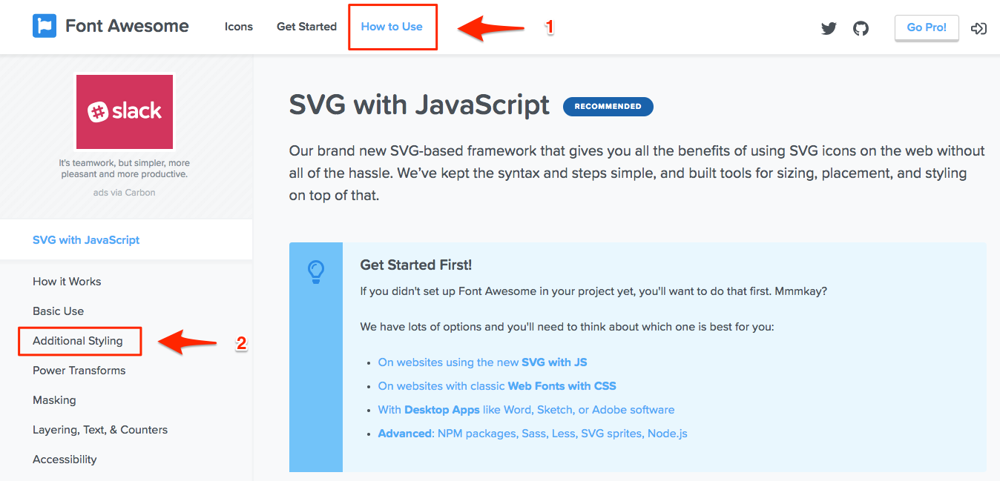

## 18.1 Lesson Plan - Responsive Grids (6:30 PM)

### Overview

- Today's class will focus on continuing to prototype with Bootstrap. Student will utilize Bootstrap's grid classes focusing on responsive layouts.

### Class Objectives

- Student will be able to explain the meaning of responsive design.

- Students will be able to change layout for small, medium, and large sizes using Bootstrap's responsive grid.

- Students will be able to using Font Awesome to incorporate icons into a webpage.

- Students will be able to build a prototype of a responsive webpage.

---

### Instructor Notes

- Students were introduced to Bootstrap grids in Unit 17 but now they will extend their knowledge to create responsive grids. As this is a crucial skill for the this weeks homework, take your time demoing activities, checking for understanding , and answer student questions.

- Use the [18.1-Responsive Bootstrap](https://drive.google.com/open?id=1YpZwGt0UL98-OYdFPzUPoSTArl4yL5UuTiac9GBd2WY) slide show provided as an initial guide for today's class. Feel free to modify the slides slightly to fit your own style, but be sure to cover the same lecture and activities.

- Have your TAs reference [TimeTracker](TimeTracker.md) to help keep track of time during class.

---

### 1. Students Do: Daily UI Challenge - Jumbotron (10 mins) (Critical)

- In this activity, students are challenged to create a customized jumbotron with a background image.

- Since this activity will not be reviewed, make sure you and your TAs are available for support.

- **Files:**

  - [01-Stu_CustomJumbotron/jumbotron.html](Activities/01-Stu_CustomJumbotron/Unsolved/jumbotron.html)

  - [01-Stu_CustomJumbotron/style.css](Activities/01-Stu_CustomJumbotron/Unsolved/style.css)

- **Instructions:**

  - [01-Stu_CustomJumbotron/README.md](Activities/01-Stu_CustomJumbotron/README.md)

### 2. Instructor Do: Responsive Design and Bootstrap (Slides) (10 mins) (Critical)

- Open the [18.1-Responsive Bootstrap Slideshow](https://docs.google.com/presentation/d/1YpZwGt0UL98-OYdFPzUPoSTArl4yL5UuTiac9GBd2WY/edit?usp=sharing)

  - Ask the students "What is meant by responsive design?"

  - Use the following slide to explain responsive design.

    

  - Explain that responsive design depends on the user and the device on which the webpage is being consumed.

  - Explain that bootstrap is already a responsive framework.

  - Point out to students that they already may have noticed that the elements on their Bootstrap webpages change when the screen size is changed.

  - Explain that Bootstrap provides a responsive grid as well.

  - Walk through the screen sizes used by Bootstrap's Responsive grid.

    

  - Explain the relationship between bootstrap and mobile first design.

  - Be sure to note the information about `col-` classes.

    

  - Show the example code and the rendered grid. Make sure to highlight the following:

    - A `col-md-6` class is used.

    - For medium screen sizes and up, each column will be size 6.

    - No extra small or small classes are used.

    - The column width is assumed to be twelve for these sizes.

    - Even though only one row is used at the extra small and small sizes the second column wraps to the next line making it appear as if there are two rows.

    

### 3. Students Do: Basic Responsive Layout (Slides 10-14) (15 mins) (Critical)

- Explain to students that the objective of this activity is to build a responsive grid by implementing the `col-md-` class.

- Open [02_Stu_BasicResponsiveLayout/BasicResponsive.html](Activities/02_Stu_BasicResponsiveLayout/Solved/BasicResponsive.html) in a browser and resize the browser window a few times so that students can see the result.

  

- Slack out the starter file and instructions.

- **File:**

  - [02_Stu_BasicResponsiveLayout/BasicResponsive.html](Activities/02_Stu_BasicResponsiveLayout/Unsolved/BasicResponsive.html)

- **Instructions:**

  - [02_Stu_BasicResponsiveLayout/README.md](Activities/02_Stu_BasicResponsiveLayout/README.md)

### 4. Instructor Do: Review Basic Responsiveness (5 mins) (Critical)

- Open [02_Stu_BasicResponsiveLayout/BasicResponsive.html](Activities/02_Stu_BasicResponsiveLayout/Solved/BasicResponsive.html) in VS Code and explain the following.

  - Only one row is used.

  - Each column is given a `col-md-4` class.

    

- Open the HTML file in a browser and stress the following.

  - Since no classes are given for sizes smaller than the `md` breakpoint, it is assumed to be twelve.

  - When the `md` screen size is reached, each column will have a span of 4.

- Only go over the bonus solution if there is time. The concepts will be covered in the next activity.

  - All that is required for the bonus is the addition of the `col-lg-2` class on each column.

- Answer any questions before checking for understanding.

- Check for understanding by asking a random student the following.

  - What size screens are affected by adding a `col-md` class?

    - Screen sizes at the `md` breakpoint and higher are affected unless a `lg` or `xl` class is added.

  - If no `col-` or `col-xs` class is specified, how are the columns displayed at `xs` and `sm` sizes?

    - If `xs` and `sm` classes are not used on a column, they render as size 12 for the corresponding screen sizes.

### 5. Instructor Do: Multiple Column Classes (10 mins) (Critical)

- Explain to students that the objective of this activity is to give an example of how you can use multiple column classes to create different layouts at different screen sizes.

- Open [03_Ins_MultipleGridClasses/multipleClasses.html](Activities/03_Ins_MultipleGridClasses/Solved/multipleClasses.html) in a browser and resize the screen to show:

  - A 6x1 grid at the `xs` size.

  - A 3x2 grid at the `sm` size.

  - A 2x3 grid at both the `md` and `lg` size.

  - 1x6 grid at the `xl` size.

- Open [03_Ins_MultipleGridClasses/multipleClasses.html](Activities/03_Ins_MultipleGridClasses/Solved/multipleClasses.html) in VS Code and go over the code.

  - Remind students that if more than 12 columns are placed in a row, it will wrap to the next row.

  - Each column has three classes:

    - `col-sm-6`

    - `col-md-4`

    - `col-xl-2`

  - Note that the grid shown to students in the browser had four different layouts. Ask students why this is the case.

    - The `col-12` class (for extra small screens) is automatic. If you don't want each image to fill the row at the `xs` screen size, use a different `col-` class.

  - For the `sm` screen size range each column has a width of 6 making a 3x2 grid.

  - Medium size screens will show 3 images in each row since 12/4=3.

  - The large screen size will have the same configuration as the medium size since it is not specified.

  - The extra large screen size will have ony one row since there are 6 columns of size 2.

- Answer any questions before checking for understanding.

- Check for understanding by asking the following:

  - How do you force the appearance of a new row without creating an additional `row` class?

    - If the next element in the row will made the sum of the current row larger than 12 columns, it will wrap to the next row.

  - Why does the large screen size have the 2x4 configuration?

    - Since a large column class was not provided, it keeps the medium configuration until it reaches the smallest extra large screen size.

    

### 6. Student Do: Make it Responsive (10 mins) (Critical)

- Explain to students that in this activity they will alter code to make a website designed for a desktop be mobile responsive.

- Open the unsolved file, [04-Stu_MakeResponsive/makeResponsive.html](Activities/04-Stu_MakeResponsive/Unsolved/makeResponsive.html),in the browser and resize to show students how the images and text are distorted when the screen size becomes smaller.

- Open the solved file, [03_Ins_MultipleGridClasses/multipleClasses.html](Activities/03_Ins_MultipleGridClasses/Solved/multipleClasses.html), in the browser and resize explaining that students will need to alter the current code to achieve this result.

- Slack out the unsolved folder and instructions to students.

- **Files:**

  - [04-Stu_MakeResponsive/Unsolved](Activities/04-Stu_MakeResponsive/Unsolved)

- **Instructions:**

  - [04-Stu_MakeResponsive/README.md](Activities/04-Stu_MakeResponsive/README.md)

### 7. Instructor Do: Review Advanced Responsiveness (5 mins) (Critical)

- Open the unsolved version , [04-Stu_MakeResponsive/makeResponsive.html](Activities/04-Stu_MakeResponsive/Unsolved/makeResponsive.html), and take ask for student volunteers in order to check for understanding. As students give the correct answers, alter the unsolved code.

- Ask students "What changes have to be made to the code for the webpage to meet the given requirements?"

  - The unsolved code has two rows. It must be altered so that all column classes are wrapped in one row.

  - The `col-3` classes have to be changed to `col-6`. This will ensure that even on extra small screen there are 2 columns instead of one.

  - A `col-md-4` must be added to each column.

  - A `col-xl-3` class much be added so that there are four cards in each row at the extra large size.

- Check for understanding by asking "Why was no `col-sm` or `col-lg` class used?"

  - The layout will keep the configuration of the smallest screen size specified until it reaches the next breakpoint. Since no `col-sm` class was specified, the layout is the same for extra small and small. It changes when it gets to the medium size size since `col-md-4` was given.

  

### 8. Everyone Do: Responsive Ordering (10 mins) (Critical)

- Explain to students that the objective of this activity is to demonstrate how to use Bootstrap's `order-` classes to change the visual order of content.

- Motivate students by explaining that important content on a desktop site might have a different location on a mobile site. For example, an important headline might be in the middle of a news site on a desktop but on a mobile device might be at the top.

- Open [05-Ins_ResponsiveOrdering/responsiveOrder.html](Activities/05-Ins_ResponsiveOrdering/Solved/responsiveOrder.html) in a browser and increase the size of the browser window until the elements read A, B, C, D.

  

  - Instruct students to watch the purple element with the letter A.

- Slowly decrease the screen size and stop when the order of the elements is D, A, B, C.

- 

  - Point out to students that elements have changed order.  The last became the first and all other elements moved down one in order.

- Continue to decrease screen size until the order is B, C, D, A.

- Open [05-Ins_ResponsiveOrdering/responsiveOrder.html](Activities/05-Ins_ResponsiveOrdering/Solved/responsiveOrder.html) is VS Code and point out that you can add `order-` classes to specify the order for extra small screens.

- Increase the browser size so that the order is C, D, A, B (small screen size).

  

- Switch back to the code and draw the connection between the visual order and the `order-sm` classes.

- Answer any questions before checking for understanding.

- Ask a student to explain how you would change the order to D, C, B, A at the extra large screen size.

  - Add `col-xl-4` to the first `col` class, `col-xl-3` to the second,then continue the pattern.

### 9. Partners Do: Responsive Ordering (25 mins) (Critical)

- The objective of this activity is to challenge students to create a responsive layout that changes both layout and order from a non-responsive grid.

- Students will work in pairs while extending their knowledge of responsive grids and practicing ordering content for responsive layouts.

- Let students know that this is a challenging activity and they should not stress too much if they cannot complete all parts in the time allotted.

- Open [06-Par_ResponsiveOrdering/responsiveOrdering.html](Activities/06-Par_ResponsiveOrdering/Solved/responsiveOrdering.html) in a browser and resize the screen a few times to show students the goal of the activity.

  - Note that not only does the layout change, but so does the order. The main headlines appear above the less important headlines for smaller screen sizes.

  - Additionally, the nested grid for the Images of the Week also changes with screen size.

- Ask students to pair up with someone around them.

- Slack out the files and student instructions.

- **File:**

  - [06-Par_ResponsiveOrdering/responsiveOrdering.html](Activities/06-Par_ResponsiveOrdering/Unsolved/responsiveOrdering.html)

  - [06-Par_ResponsiveOrdering/XsSmLayout.png](Activities/06-Par_ResponsiveOrdering/Unsolved/XsSmLayout.png)

  - [06-Par_ResponsiveOrdering/MdLayout.png](Activities/06-Par_ResponsiveOrdering/Unsolved/MdLayout.png)

  - [06-Par_ResponsiveOrdering/LgXlLayout.png](Activities/06-Par_ResponsiveOrdering/Unsolved/LgXlLayout.png)

- **Instructions:**

  - [06-Par_ResponsiveOrdering/README.md](Activities/06-Par_ResponsiveOrdering/README.md)

---

### 10. BREAK (15 mins)

---

### 11. Instructor Do: Review Responsive Ordering (10 mins) (Critical)

- Open [06-Par_ResponsiveOrdering/responsiveOrdering.html](Activities/06-Par_ResponsiveOrdering/Solved/responsiveOrdering.html) and walk through important parts of the solution.

  - Note for students that there solutions maybe slightly different but still accomplish the end goal.

  - First,remove all `col-` classes from the three main sections: "Articles of Lesser Importance", "Main Headlines", and "Images of the Week"

  - Add the following classes to "Articles of Lesser Importance":

    - `col-md-4`: This allows this section to have a column width of 12 up to the medium size, and a column width of 4 at the medium size.

    - `col-lg-3`: This switches the column width to size 3 for large and extra large screens.

    - `order-2`: This sets the visual order to 2 at the small and extra small sizes.

    - `order-md-1`: This sets the order to 1 for medium , large, and extra sizes.

  - Add the following classes to "Main Headlines":

    - `col-md-8`: This allows this section to have a column width of 12 up to the medium size, and a column width of 8 at the medium size.

    - `col-lg-6`: This switches the column width to size 6 for large and extra large screens as was in the original non-responsive design.

    - `order-1`: This sets the visual order to 1 at the small and extra small sizes allowing the most important content to appear at the top of the screen.

    - `order-md-2`: This sets the order to 2 for medium , large, and extra sizes as it was in the original.

  - Add the following classes to "Images of the Week":

    - `col-lg-3`: This allows the content to span the page for column widths smaller than the large size.  At the large size, it switches back the original column width.

    - `order-3`: This ensures that the visual order is always after the other two sections for all screen sizes.

  - Complete the follow classes for the nested grid in "Images of the Week":

  - Change the `col-12` classes to `col-6`. This will make a 2x2 grid at the extra small and small sizes.

  - Add `col-md-3`. This will make a 1x4 grid at the medium size.

  - Add `col-lg-12`. This will make a 4x1 grid at the large size as it was originally.

### 12. Everyone Do: FontIcons (10 mins) (Critical)

- Explain to students that by the end of this activity they will know how to incorporate pre-made FontIcons into a webpage by following along.

- Let students know that included FontIcons will be required in the homework this week.

- Before showing student the [Font Awesome Webpage](https://fontawesome.com/) open and slack out the starter file, [07-Evr_FontIcons/fontIcons.html](Activities/07-Evr_FontIcons/Unsolved/fontIcons.html)

- Navigate to the [Font Awesome Webpage](https://fontawesome.com/). This icon library contains both free and paid icons.

  - Explain that Font Awesome Icons work the same as bootstrap classes or Google Fonts. A CDN is used to pull in the icon styles.

- Show the [Font Awesome Icons Gallery](https://fontawesome.com/icons).

- Click the **Get Started** option from the navbar, then select **Web Fonts with CSS**.

- Copy the link on the site, or below, and paste it inside of the `<head>` of [07-Evr_FontIcons/fontIcons.html](Activities/07-Evr_FontIcons/Unsolved/fontIcons.html).

    

- From the Font Awesome website search for and select the "info" icon. Once selected, you should be brought to a page that resembles the one pictured below. Copy the provided HTML code and paste into the HTML document.

  

- Show students the result in the browser.

  

- Navigate to the [Font Awesome - How To Use](https://fontawesome.com/how-to-use/svg-with-js) page and choose "Additional Styling" from the navigation menu on the left.

  

  - Explain to student that Font Awesome provides additional styling classes much like Bootstrap Utility classes.

- Add a `fa-10x` class to the icon

  

- Show the result in the browser.

  

- Explain to the class that is no shortage of free and paid resources for icons online. Encourage students to try these with their own projects and explore other icon resources online.

- Inform the class that not every library works the *exact* same way, but they'll often follow similar rules. Normally, A little digging into the documentation will help them find what they need.

- Answer any questions before moving onto the next activity.

### 13. Students Do: Responsive News (45 mins) (Critical)

- The objective of this activity to to have students build a responsive grid using Bootstrap classes to match U.S. News and World Report's website.

- Let students know that this will be a challenging task and that the expectation is that they try to reproduce the layout images to the best of their ability.

- Recommend that student get the responsive layout working first, and them add the custom content and perform any additional adjustments if there is time.

- Students should not expect to match each layout image exactly as they do not have all the skills to do that yet.

- Make sure to slack out the entire unsolved folder, [08-Stu_ResponsiveNews/Unsolved](Activities/08-Stu_ResponsiveNews/Unsolved), since text and assets they need to build the site are there.

- Show students the solved version, [08-Stu_ResponsiveNews/usnews.html](Activities/08-Stu_ResponsiveNews/Solved/usnews.html), in a browser so they have a idea of the intended outcome.

- Ensure they you and your TAs are available during this activity for student support. There is no review activity.

- **Files:**

  - [08-Stu_ResponsiveNews/Unsolved](Activities/08-Stu_ResponsiveNews/Unsolved)

- **Instructions:**

  - [08-Stu_ResponsiveNews/README.md](Activities/08-Stu_ResponsiveNews/README.md)

- Slack out the solution when the activity time is up. Students can look through it on their own time or the solution can be walked through during office hours.

### 14. Instructor Do: Critiques (25 mins) (Critical)

- Randomly 3-5 select students using [the randomizer](https://www.switchboard.tech/) or ask for volunteers to present their work for critique.

- Students can choose to:

  - Walk through their US News solution.

  - Present their UI Jumbotron challenge.

# LessonPlan & Slideshow Instructor Feedback

- Please click the link which best represents your overall feeling regarding today's class. It will link you to a form which allows you to submit additional (optional) feedback.

- [:heart_eyes: Great](https://www.surveygizmo.com/s3/4346059/UX-UI-Instructor-Feedback?section=18.1&lp_useful=great)

- [:grinning: Like](https://www.surveygizmo.com/s3/4346059/UX-UI-Instructor-Feedback?section=18.1&lp_useful=like)

- [:neutral_face: Neutral](https://www.surveygizmo.com/s3/4346059/UX-UI-Instructor-Feedback?section=18.1&lp_useful=neutral)

- [:confounded: Dislike](https://www.surveygizmo.com/s3/4346059/UX-UI-Instructor-Feedback?section=18.1&lp_useful=dislike)

- [:triumph: Not Great](https://www.surveygizmo.com/s3/4346059/UX-UI-Instructor-Feedback?section=18.1&lp_useful=not%great)

---

### Copyright

Trilogy Education Services © 2018. All Rights Reserved.
