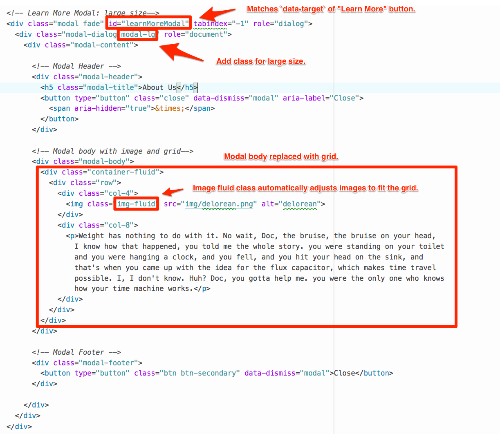
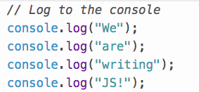

## 19.1 Lesson Plan - Intro Web Behavior JS/jQuery (6:30 PM)

### Overview

Today's class will be an introduction to JavaScript, jQuery, and the relationship between them and the web as a whole. They explore this by investigating and building upon interactive Bootstrap components.

### Class Objectives

- Students will be able to identify common behaviors associated with web content and how JavaScript plays a role in those behaviors.

- Students will understand the how HTML, CSS, and JS work together.

- Students will understand and be able to use script tags.

- Students will be able to use interactive Bootstrap components.

- Students will be able to select elements using jQuery.

- Students will be able to set up event handlers.

- Students will be able to show/hide elements on an event trigger.

### Instructor Notes

- Welcome to Unit 19 and JavaScript! This is really the students' first step in building interactive web pages. In this class, students will write some basic jQuery and do some basic web interaction.

- If you haven't done much JavaScript before, this unit will be very challenging for you. We *strongly* recommend practicing all of the activities yourself before class to better know what you're teaching.

- The goal of this unit is to help students build mental models around what's possible with the tools of the web, and to better understand the medium for which they're designing. The better they understand the limitations and the possibilities of the web, the better they'll be able to design for it. Thus, the expectation is not that students become expert JS developers - that's not going to happen in a couple weeks. The intent is to build familiarity, demystify, and form a base on which they could build.

- This class will feel very intimidating to students. Spend the time necessary, dredge out questions, and resolve confusion early and often. Explain that no one learns to code easily, and the important thing is to just soak up as much as you can. Remind them it's okay to be uncomfortable.

- Take the time to familiarize yourself with the activities in this lesson - having students practice is more important than the presentation, slides, or explanation of code.

- Stay on topic! Everything you talk about outside of the lesson is an opportunity for students to get confused or lost.

- Use the [19.1-Intro-JS-jQuery-Web-Behaviors slide show][1] as an initial guide for today's class. Feel free to modify the slides to fit your own style, but be sure to cover the same lecture and activities.

- Have your TAs reference [TimeTracker](TimeTracker.md) to help keep track of time during class. It will be hard to keep time, there are a lot of activities; be sure to keep close track of the day's progression.

---

### 1. Instructor Do: Intro Agenda and Dropdowns (3 mins)

- Open the [slide show][1] to kick off the class.

- Briefly talk through the agenda.

- Start class by talking about the dropdown component.

- Ask: "What is the difference between a card and a dropdown?"

- Explain that the card component shown in the slide (3) is just basic static content.

- (4) Explain that, in contrast, the dropdown is an interface - something the user would interact with on the page.

### 2. Instructor Do: Demo Dropdowns (7 mins)

- Without yet adding the `.js` file, walk through the process of creating a basic Bootstrap page and adding a dropdown component to it.

  - Create a basic HTML file to add Bootstrap and a dropdown to, or use the code in [Activities/Ins_Dropdown](Activities/01-Ins_Dropdown/Solved/dropdown.html) as a starting point.

    - Go to the [Bootstrap documentation for dropdowns](https://getbootstrap.com/docs/4.1/components/dropdowns/#single-button) and demo the first basic example in the documentation.

      

  - Copy the code to your own file.

  - Open your file in the browser and try clicking the button. Nothing should happen.

  - Ask: "What is missing here?"

  - Explain that without JavaScript, these Bootstrap components won't function. They need JS for the interactivity.

  - Add the Bootstrap JS file as outlined in the [Getting started Bootstrap guide](https://getbootstrap.com/docs/4.1/getting-started/introduction/#js). If you're not coding from scratch, you can just un-comment the JS file at the bottom of the HTML.

  - Save the file. Reopen/refresh the file in the browser and show the working dropdown element.

- Explain that this interaction just shows new elements. We can customize all of this the same way we've customized other elements.

- Walk through the process of inspecting the "new" element in the dropdown and customizing the style.

  

- Ask students if they have any questions before moving on.

### 3. Students Do: Daily UI (Investigate/Customize Dropdown) (15 mins)

- Explain that it's that easy to use JavaScript and interactivity with Bootstrap! Just like with CSS, we can take advantage of their code so that we don't have to write our own JS. We'll be writing our own JavaScript soon, though.

- Explain that for now, we're going practice using Bootstrap's JavaScript! (go back to slides)

- Explain that Bootstrap has a ton of components that are interactive that use JavaScript. We're starting with dropdowns today, but will cover many more over the next few days.

- Give students 15 minutes to sketch, design, and prototype a basic dropdown component for a use case of their choice.

- If time allows, ask a student or two to present and justify their design decisions.

### 4. Instructor Do: JS & Web Behaviors - Slides (10 mins)

- Tell students we're going to dive into some more JavaScript and Bootstrap Components.

- Use the slides to explain the basics of JS.

  - JavaScript is one of the tree main pillars of the web: HTML, CSS, JS

  - It controls the logic, dynamic display, and updating of content after the page load.

  - It can do a ton of stuff! (12) Even crazy things like machine learning and graphics/visualizations.

  - Many of the Bootstrap components require JS to function at all. Carousels, dropdowns, navbars, etc.

- Explain that one such Bootstrap component that requires JS is the modal, and we'll be using that one as a basis.

### 5. Instructor Do: Motivating with Modals (5 mins)

- The purpose of this activity is to demonstrate a bootstrap modal to students and show some use cases. Don't go through the code here.

- Start by demoing [Ins_ModalsIntro/Solved/modals.html](Activities/02-Ins_ModalsIntro/Solved/modals.html) in a browser and click the button to demonstrate modal functionality.

  

- Before opening the slides, ask "*Where have you seen this on the web?*"

- Go through the slides (15-17) to give visual examples of use cases.

- Slack out the link the to [Bootstrap Modals Documentation](https://getbootstrap.com/docs/4.1/components/modal/).

### 6. Students Do: Make A Modal (10 mins)

- Explain to students that, in this activity, they will create a webpage with a button that triggers a modal on click.

- Slack the file and instructions to students.

- **File:**

  - [Stu_MakeAModal/modal.html](Activities/03-Stu_MakeAModal/Unsolved/modal.html)

- **Instructions:**

  - [Stu_MakeAModal/README.md](Activities/03-Stu_MakeAModal/README.md)

  **Instructor Note:** As you walk around to help students troubleshoot, first check that they have included the Bootstrap's JavaScript CDNs.

### 7. Instructor Do: Review Make A Modal (5 mins)

- Open [Stu_MakeAModal/Solved/modal.html](Activities/03-Stu_MakeAModal/Solved/modal.html) and use the below image to guide your review.

- Be sure to cover:

  - The `data-toggle` attribute.

  - The `data-target` attribute.

  - The `modal` class.

  - The ID assigned to the modal.

  - `data-dismiss = "modal"`

    

- Ask students if they have any questions before tasking them with the next activity.

### 8. Students Do: Multiple Modals (20 mins)

- In this activity, students will expand on concepts learned in the previous activity to add modals to multiple buttons and change the modal content.

- Open [Stu_MultipleModals/multipleModals.html](Activities/04-Stu_MultipleModals/Solved/multipleModals.html) and click on each of the buttons to show students the result. Note that the "Image Library" button is the bonus.

  - The HTML for the buttons already exists. Students will need to add the code for the modals.

  - Students will have build one modal with a form and another modal with an image and text.

  - Tell students that if their modals are not working, they must find the bug. (Don't tell them! But ... the Bootstrap JavaScript and jQuery links have not been included in the unsolved version.)

  - As a bonus activity, students are asked to add an additional button and create a modal that includes a carousel of images.

- Slack out the activity file and instructions to students.

- **File:**

  - [Stu_MultipleModals/multipleModals.html](Activities/04-Stu_MultipleModals/Unsolved/multipleModals.html)

- **Instructions**

  - [Stu_MultipleModals/README.md](Activities/04-Stu_MultipleModals/README.md)

### 9. Instructor Do: Review Multiple Modals (10 mins)

- Open [Stu_MultipleModals/multipleModals.html](Activities/04-Stu_MultipleModals/Solved/multipleModals.html) in a text editor to review the code.

  - The `data-toggle` and `data-target` classes are set in order to link them to the modals.

  

- For the "Sign Up" modal, go over the adjustments needed to the source code highlighted in the image below.

  

- For the "Learn More" modal, go over the adjustments needed highlighted in the image below.

  

- For the bonus, go over the changes highlighted below.

  

### 10. Break (15 mins)

### 11. Instructor Do: Button Alerts Demo (5 mins)

- Welcome students back to class from break.

- Explain that the next interactive component we're going to look at is a Button Alert.

- Open [10-Stu_AlertButtons/alertButtons.html](Activities/10-Stu_AlertButtons/Solved/alertButtons.html) in the browser and demo the functionality.

  - Click the "Save" button, dismiss the alert, and refresh the page a few times for students to see the functionality. Do the same for the "Delete" button.

    

- Ask the class - "So, easy, right? Just like the modal?"

  - Unfortunately, not quite! Bootstrap provides modal functionality by default, so we didn't have to write any JavaScript.

  - No "Button Alert" component exists in Bootstrap. We'll have to build our own JavaScript to make our "Button Alert" component.

- Demo what happens to the alert when it is dismissed.

  - Open DevTools while the alert is open on the page.

  - Ask students what they expect will happen when "X" is clicked.

  - Draw students attention to the code under `<!-- Regular Solution Alert -->`

    

  - Click the "X" and show that element is completely removed from the page!

    

- Reiterate that adding and removing elements is done using JavaScript.

- Explain that we're going to walk through the necessary steps to build this interaction by the end of class.

### 12. Instructor Do: JavaScript and DOM Fundamentals - Slides 22-31 (10 mins)

- Explain that in order to build such a component, we have to understand some of the basics. How is JavaScript used, and what for?

- Use the slides to go through some of the JS fundamentals. Don't get bogged down! High-level is good enough for theory; practice makes perfect. Be sure to touch on:

  - JS is used for event handling and DOM manipulation

  - You use a `` in the `<body>`.

  - Explain that this will run our JavaScript file when the webpage loads.

  

  - Refresh the browser and show students the output in the console.

  

### 14. Students Do: My First JS (5 mins)

- In this activity students will practice logging text to the console by incorporating a `.js` file in their HTML.

- Slack out the files and instructions to students.

- **Files:**

  - [Activities/06-Stu_FirstJS/Unsolved/firstJS.html](Activities/06-Stu_FirstJS/Unsolved/firstJS.html)

  - [Activities/Stu_FirstJS/Unsolved/first.js](Activities/06-Stu_FirstJS/Unsolved/first.js)

- **Instructions:**

  - [Stu_FirstJS/README.md](Activities/06-Stu_FirstJS/README.md)

- Walk around and make sure everyone gets this working.

- Explain that we won't review this activity, but that you're happy to help out once the next activity starts for anyone who got stuck.

### 15. Everyone Do: Introduce alerts stage 1 (10 mins)

- Take a second to ask: "Now let's look back at our Button Alerts. What kind of JavaScript behavior do we have here?"

- Explain that know that we know how to include JavaScript, we need some way to do some of the earlier behavior we talked about. (slide 35)

- Explain that we need to know how to write JavaScript to handle events and to manipulate the DOM. (slide 36)

- For both of these behaviors we need some easy way to reference elements on the page. (the button and the alert)

- Explain that this is where jQuery comes in!

- Use slides 37-41 to quickly re-introduce the concept of libraries and to introduce jQuery.

- Point out that the way that we reference elements in jQuery is by using the same selector we would in CSS. (41)

- Tell students that understanding every character (syntax) isn't important for now, but we're going to dive headfirst into an activity.

- Explain the pieces of a click handler using the slide.

- Answer any questions before moving on.

### 16. Students Do: Event Handlers (10 mins)

- Given three buttons and some initial empty click handlers in jQuery, students will be asked to `console.log` the relevant information for a set of buttons when those buttons are clicked.

- **File:**

  - [07-Stu_EventHandlers/Unsolved/event.html](Activities/07-Stu_EventHandlers/Unsolved/event.html)

- **Instructions:**

  - [Stu_EventHandler/README.md](Activities/07-Stu_EventHandlers/README.md)

### 17. Instructor Do: Review Event Handlers (10 mins)

- Outline/annotated solution images for HTML and CSS for instructor walkthrough of event handlers solution.

### 18. Instructor Do: DOM Manipulation (5 mins)

- So now we know how to make things happen on click. Pretty cool!

- Ask: "But what did we want to happen on click?"

  - Answer: We wanted an element (the alert) to appear on the page. That's what we need to learn how to do next. Make elements appear/disappear.

  - This is known as DOM manipulation. JS can help us here, too!

- Ask: "How have we made elements disappear in the past?"

  - Answer: with CSS: `display: none`

  - Explain that we'll still need a selector, to identify which element is being modified.

  - We can change classes with CSS, which would accomplish this, but jQuery also gives us `hide` and `show` functions we can use (much like the `click` function).

- Next, we need to make an element appear on the page when an element is clicked.

- Depending on time, you can walk through the example in [08-Ins_DOMManipulation/Solved/ins-dom.html](Activities/08-Ins_DOMManipulation/Solved/ins-dom.html). If you're short on time, you can skip this and leave it to the students.

### 19. Students Do: DOM Manipulation (10 mins)

- Tell students that in this activity they'll be showing and hiding elements on the page based on user interaction.

- Given a button and a hidden image, students will write an event handler which shows the hidden element when the button is clicked.

- **File:**

  - [09-Stu_DOMManipulation/Unsolved/dom.html](Activities/09-Stu_DOMManipulation/Unsolved/dom.html)

- **Instructions:**

  - [09-Stu_DOMManipulation/README.md](Activities/09-Stu_DOMManipulation/README.md)

### 20. Instructor Do: Review DOM Manipulation (5 mins)

- Explain that this is how almost all interaction on the web works - showing/hiding elements and/or changing classes based on interaction

- Explain that this is essentially how the modal we used earlier works as well.

- Walk through the code solution, calling out the relevant pieces in both the HTML and the JS/jQuery.

### 21. Students Do: Button Alerts (15 mins)

- Time to pull it all together!

- In this activity, students will create a button. When clicked, that button will add a dismissible alert to the page.

- Students are given an empty HTML file so they must create the page from the ground up ensuring that they have included all necessary CDNs.

- There are two bonuses to this activity:

  1. Create an extra button that triggers a different alert.

  1. Alter the code so that the alert can be triggered and dismissed several times.

- Slack out the instructions and starter file to students.

- **File:**

  - [10-Stu_AlertButtons/alertButtons.html](Activities/10-Stu_AlertButtons/Unsolved/alertButtons.html)

- **Instructions:**

  - [10-Stu_AlertButtons/README.md](Activities/10-Stu_AlertButtons/README.md)

### 22. Instructor Do: Review Button Alerts (5 mins)

- Open [Activities/10-Stu_AlertButtons/Solved/alertButtons.html](Activities/10-Stu_AlertButtons/Solved/alertButtons.html) and [10-Stu_AlertButtons/Solved/alert.js](Activities/10-Stu_AlertButtons/Solved/alert.js)

- Walk through the code using the below images as a guide.

- Make sure to point out:

  - The HTML Alert.

  - The CSS Styling.

  - The JavaScript Handler.

  

  

- Briefly go over the bonus solution to reinforce concepts.

  - Note for students that the "Delete" button uses the `btn-danger` class and the alert uses `alert-danger`.

- If time allows, open [10-Stu_AlertButtons/alertButtonsBonus.html](Activities/10-Stu_AlertButtons/Solved/alertButtonsBonus.html) and [10-Stu_AlertButtons/alertBonus.js](Activities/10-Stu_AlertButtons/Solved/alertBonus.js) and cover the following:

  - The `data-dismiss` attribute is removed from the buttons in the alerts.

  - An ID is added to each of the `X` buttons in the alerts.

    

  - An event listener is placed on each `X` button that hides the alert when clicked.

    

### 23. Instructor Do: Close class/introduce homework (5 mins)

- Introduce the homework and send out the homework instructions

- Ask students if they have any questions before calling it for the day.

---

# LessonPlan & Slideshow Instructor Feedback

- Please click the link which best represents your overall feeling regarding today's class. It will link you to a form which allows you to submit additional (optional) feedback.

- [:heart_eyes: Great](https://www.surveygizmo.com/s3/4346059/UX-UI-Instructor-Feedback?section=19.1&lp_useful=great)

- [:grinning: Like](https://www.surveygizmo.com/s3/4346059/UX-UI-Instructor-Feedback?section=19.1&lp_useful=like)

- [:neutral_face: Neutral](https://www.surveygizmo.com/s3/4346059/UX-UI-Instructor-Feedback?section=19.1&lp_useful=neutral)

- [:confounded: Dislike](https://www.surveygizmo.com/s3/4346059/UX-UI-Instructor-Feedback?section=19.1&lp_useful=dislike)

- [:triumph: Not Great](https://www.surveygizmo.com/s3/4346059/UX-UI-Instructor-Feedback?section=19.1&lp_useful=not%great)

---

### Copyright

Trilogy Education Services © 2018. All Rights Reserved.

[1]: https://docs.google.com/presentation/d/1laYVAJ0P0jObayHhF63rgxvXUOkRkL_m2ks-8H8DoJc/edit?usp=sharing
