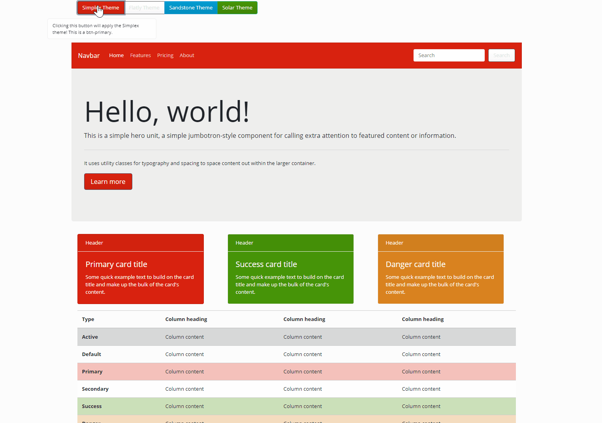

### Student Do: Theme Changer (40 minutes)

**Files**

- [Unsolved/unsolved.html](Unsolved/unsolved.html)
- [Unsolved/unsolved.js](Unsolved/unsolved.js)

**Instructions**

- Visit [Bootswatch.com](https://bootswatch.com/) and bookmark four themes that you like. You are going to use them in the next step.

- Next, take a look at the example below. You will see that there are four different buttons that dynamically update the CSS stylesheet when clicked. You are going to implement this functionality.



- Also notice that when a button is hovered, a Bootstrap popover is displayed, stating the name of the new stylesheet. You will be implementing this as well.

- Open [Unsolved/unsolved.html](Unsolved/unsolved.html) in your browser.

- Currently the buttons are called theme1, theme2, theme3, theme4. These themes have corresponding `ids` with the same names. See the screenshot below.


#### Step 1: Update the HTML Buttons

- Open [Unsolved/unsolved.html](Unsolved/unsolved.html) in VS Code and find the four buttons that control the theme changes.

  ```html
  <div class="btn-group mb-5" role="group" aria-label="Basic example">
    <button type="button" id="theme1" class="theme-button btn btn-primary">theme1</button>
    <button type="button" id="theme2" class="theme-button btn btn-secondary">theme2</button>
    <button type="button" id="theme3" class="theme-button btn btn-info">theme3</button>
    <button type="button" id="theme4" class="theme-button btn btn-success">theme4</button>
  </div>
  ```

- Update the theme placeholder names and `ids` with the names of the stylesheets that you've chosen.

- For example if you picked flatly as one of your four themes, you would change theme1 to flatly, theme2 to the next theme you picked and so on until all of the themes have been updated.

#### Step 2: Add the Logic

- You now are going to write jQuery code to implement the theme changing functionality via the following steps.

  1. Open [Unsolved/unsolved.js](Unsolved/unsolved.js) in VS code.

  2. Write code according to the comments. Start by setting up a click event listener for the `theme-button` class.

  3. Create a variable named `theme` to store the name of the theme that was just clicked.

  4. Create another variable called `$styleLink` to store the link with the id `theme-stylesheet`

  5. Using if/else conditionals, update the stylesheet according to the button that was clicked (the button/theme name).

  6. Test to make sure that when you click a button, the theme is applied.

### Step 3: Include the Popovers

You are now going to create the Bootstrap popover functionality with the following steps:

1. At the bottom of [Unsolved/unsolved.js](Unsolved/unsolved.js), under your theme changer code that you just wrote, initialize Bootstrap popovers for you webpage.

2. Open the [Unsolved/unsolved.html](Unsolved/unsolved.html) and edit your HTML buttons by adding `data-toggle`, `data-content`, and `data-placement` attributes to each button.

  - *HINT* the code you're looking for is in the Bootstrap popover docs.

3. When you are finished, refresh your web page to see the changes and make sure the functionality is working correctly.

### Bonuses

1. Add additional components to the page to see how they change with the theme.

2. Add a "Surprise me!" button which picks a theme of your choice.

3. Incorporate the buttons into the jumbotron as a carousel, so that each one has an associated description and an "Apply" button. (challenging)

4. Add a "Random Theme" button which randomly chooses a theme (This one is tough! will take a lot of googling and includes concepts we haven't covered.).
