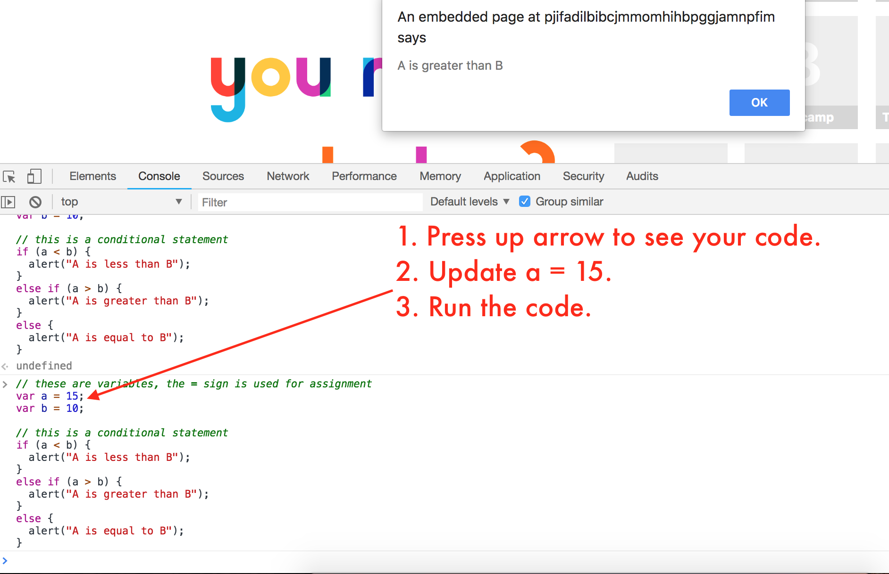

## 19.2 - jQuery Continued (6:30 PM)

### Overview

- In today's class, students will use jQuery to learn more about how interactivity in the web works with real-world examples. They'll build counters, enhance existing UI Patterns, change themes on a web page, and handle other user interaction.

### Class Objectives

- Students will be able to identify and implement variables.

- Students will be able to identify and implement event listeners.

- Students will be able to identify and implement click handlers.

- Students will be able to identify and implement conditional logic using if / else statements.

- Students will be able to store and retrieve information from the DOM.

---

### Instructor Notes

- Let students know that the today's class is going to be challenging. Tell them that they will feel frustrated at times and this is ok. The concepts they will be learning take time to fully grasp, so give yourself that time.

- There are no slides today! All code.

- If you're not comfortable with jQuery yourself, we recommend you read through the activities and try them yourself before class.

- Have your TAs reference [TimeTracker](TimeTracker.md) to help keep track of time during class.

- You can find the slideshow here [jQuery Continued Slideshow](https://docs.google.com/presentation/d/1nLCey8dmy2EQ6C_eDMuCbE8HIa3AhV-90GrTUZaXO8Y/edit?usp=sharing)

---

### 1. Instructor Do: jQuery Counter Demo (20 min)

- There is a good chance this is going to be difficult for some students, especially if they are visual learners.

- Really take the time to explain the concepts piece by piece and don't rush through it.

- Explain that the objective of this activity is to be able to explain how the counter code uses variables, event listeners and click handlers to change the number of our counter.

- Open [01-Ins_jQuery_Counter/Solved/solved.html](Activities/01-Ins_jQuery_Counter/Solved/solved.html)

- Take a couple minutes to demo the functionality, counting up, down and resetting.

  - Ask: "How is our page showing a different number every time we click? Where is the number coming from? Where is that information being stored and retrieved?"

- Try and lead them to the idea that we're modifying the DOM on click and the count is being stored in memory.

- Next, open the Chrome Developer tools.

- Inspect the page and point out the `span` element where the number count is being displayed.

- Point out how it has an `id` of `counter`.


- Count up and down a few times while showing how the number count is dynamically changing.

- Select the counter `span` and delete the `counter` `id`.

- Now, try to count up and down showing how nothing happens.

  - This is happening because the `counter` `id` was removed.

  - jQuery uses this id to select and manipulate the DOM.

### Live Code

- At this point, you are going to live code the counter functionality in the [01-Ins_jQuery_Counter/Unolved/unsolved.js](Activities/01-Ins_jQuery_Counter/Unsolved/unsolved.js) file.

- In [01-Ins_jQuery_Counter/Unolved/unsolved.js](Activities/01-Ins_jQuery_Counter/Unsolved/unsolved.js) code each line, one at a time, explaining what is happening as you go.

```js
// First, point out the counter variable. Reiterate that var stands for variable, and we are setting our default counter variable to 0.
var counter = 0;

// Explain that the counter id in our HTML is selected then .text is called. The counter value is then passed to .text to be displayed on our page.
$("#counter").text(counter);

// Explain that we have an click listener on our #add id (in our HTML).
$("#add").click(function () {
  // When it's clicked, our counter is incremented by 1.
  counter = counter + 1;
  // The total is then displayed.
  $("#counter").text(counter);
});
```

- After you have finished coding, refresh your browser to show the result.

- Repeat the same process for our subtract and reset functionality to reinforce the concepts.

- Use the [01-Ins_jQuery_Counter/Solved/solved.js](Activities/01-Ins_jQuery_Counter/Solved/solved.js) version if you need guidance.

- Before moving on check for understanding by asking:

  - What is a variable?

  - What happens when we call `.text` on an element?

  - How does this code work: `counter = counter + 1;`?

### 2. Student Do: jQuery Counter (25 min)

- In this activity, students are going to implement the same functionality as the demo to reinforce the concepts from the demo.

- They are given the increment functionality and asked to implement decreasing and resetting the counter.

- **Files**

  - [02-Stu_jQuery_Counter/Unsolved/unsolved.html](Activities/02-Stu_jQuery_Counter/Unsolved/unsolved.html)

  - [02-Stu_jQuery_Counter/Unsolved/unsolved.js](Activities/02-Stu_jQuery_Counter/Unsolved/unsolved.js)

- **Instructions**

  - [02-Stu_jQuery_Counter/README.md](Activities/02-Stu_jQuery_Counter/README.md)

### 3. Instructor Do: Review Counter Badge (10 min)

- This activity is a mostly a review of the instructor demo, with a good amount of starter code.

- Sometimes syntax can be tricky when first learning jQuery, so make sure to check how the class is feeling about the syntax and logic being implemented.

- Open [02-Stu_jQuery_Counter/Solved/solved.js](Activities/02-Stu_jQuery_Counter/Solved/solved.js) in VS Code.

- Ask for a volunteer to walk you through their solution, starting with the increment function.

- Ask for another volunteer to walk you through the reset functionality.

- It may feel a bit redundant, but they are going to have to see these examples quite a few times before they start to really sink in, so take your time going over the details.

- Before moving on, take any questions that the students might have.

### 4. Everyone Do: Forms (10 mins) (Critical)

- In this activity, students will follow along as you live code an event listener that retrieves input from a form, saves it as a variable, and returns it to the DOM.

- Feel free to use [Solved/forms.js](Activities/03-Ins_Forms/Solved/forms.js) as a reference as you live code.

- Slack out the [Unsolved Folder](Activities/03-Ins_Forms/Unsolved) to students so that they may follow along.

- First, open [Ins_Forms/forms.html](Activities/03-Ins_Forms/Unsolved/forms.html) in a text editor and browser.

  - Explain that they will follow along as you write JS that will retrieve the input from the form and then show a paragraph under that will report who was the last person to push the button.

  - Point out the code shown in the image below. Be sure to cover the IDs of the input, button, and paragraph elements as shown in the image below.

  - Note that the last paragraph element is empty. Explain that HTML will be inserted here using JavaScript.

  

- Then, open [Ins_Forms/forms.j](Activities/03-Ins_Forms/Unsolved/forms.js) and type out the code as shown below including comments.

- Make sure to cover the following:

  1. A click event listener is created on the "Push the Button!" button

  1. The input is retrieved from the form by selecting the input element and using `.val()`.

  1. HTML is inserted into the paragraph element by using the HTML class.

     - Note that string concatenation is used here. In order to join a variable with text (a string), a `+` sign must be placed between them and strings must be wrapped in quotations.

     - Explain that using `.html()` will replace any existing HTML.

  1. The form is cleared using `.val("")`.

     - Explain that we are setting the value of the input to an empty string (blank) by using `""`.

  

- Open the HTML file in a browser to demonstrate the result.

  

### 05. Students Do: UX Daily Challenge - Interactive Form (25 mins) (Critical)

- In this activity, students will create a form that, upon submission, will trigger a modal with a message including information from the form.

- Open [Stu_Forms/Solved/form.html](Activities/04-Stu_Forms/Solved/form.html) in a browser, type some text into the fields, and click the "Send Email" button in order to demonstrate the result to students.

  

  - They will provided with the HTML for the modal but must create the form.

  - They must create an event listener for the form button that will retrieve a value from the form, set HTML using that value, and clear the form.

  - The bonus activity requires conditionals to verify that the needed form fields were not left blank.

- **Instructor Note:** This is likely to be a challenging activity for most students. As you walk around to answer questions, encourage students to test their code in each step of the process. For example, test to see that the modal is being triggered or use console.log("Event Listener Working") to make sure the button click is being registered.

- Slack out the instructions and files to students.

- **Files:**

  - [Stu_Forms/form.html](Activities/04-Stu_Forms/Unsolved/form.html)

  - [Stu_Forms/form.js](Activities/04-Stu_Forms/Unsolved/form.js)

- **Instructions:**

  - [Stu_Forms/README.md](Activities/04-Stu_Forms/README.md)

### 06. Instructor Do: Review Interactive Forms (10 mins) (Critical)

- Open [Stu_Forms/form.html](Activities/04-Stu_Forms/Solved/form.html) in a text editor and point out the following important pieces of code:

  1. The `id` of the "First Name" input box.

  1. The `id`, `data-toggle`, and `data-target` attributes of the "Send Email" button.

  1. The `id` of the modal.

     

- Open [Stu_Forms/form.js](Activities/04-Stu_Forms/Solved/form.js) in a text editor and point out the following:

  1. Saving the the first name to a variable.

  1. The string concatenation use to create the message.

  1. Using `.html()` to set the `modal-body`.

  1. Clearing the form using `val("")` on all `form-control` classes.

     

- Open [Stu_Forms/formBonus.js](Activities/04-Stu_Forms/Solved/formBonus.js) and go over the bonus code.

- Make sure to highlight the if/else conditional using the following image.

  

- Demonstrate the bonus in the browser:

  1. Comment out the script tag for the regular solution and un-comment the script for the bonus solution

     

  1. Refresh the page

  1. Leave the "First Name" field blank and click "Send Email"

  1. Include a first name and resubmit the form.

  

### 7. Break: (15 mins)

### 8. Instructor Do: Introduce Bootstrap Themes (5 mins)

- Explain to the students that up until now, we have been using the built in Bootstrap styles or writing our own CSS.

- Tell them that the open source community has created many Bootstrap themes that we can use.

- Slack out the link to [Bootswatch](https://bootswatch.com/) and direct them to the "themes" dropdown menu.

- Explain that Bootswatch is a website with many different themes that we can link to.


### 9. Students Do: Changing Bootstrap Themes (10 mins)

- In this activity, students are going to practice implementing different Bootswatch themes.

- Explain to them that they will also be practicing using event listeners and click handlers to change the themes.

- **Files**

  - [Activities/05-Stu_Changing_Bootstrap_Themes/Unsolved/unsolved.html](Activities/05-Stu_Changing_Bootstrap_Themes/Unsolved/unsolved.html)
  - [Activities/05-Stu_Changing_Bootstrap_Themes/Unsolved/unsolved.js](Activities/05-Stu_Changing_Bootstrap_Themes/Unsolved/unsolved.js)

- **Instructions**

  - [05-Stu_Changing_Bootstrap_Themes/README.md](Activities/05-Stu_Changing_Bootstrap_Themes/README.md)

### 10. Instructor Do: Review Changing Bootstrap Themes (5 min)

- Open the [solved html](Activities/05-Stu_Changing_Bootstrap_Themes/Solved/solved.html) in your browser and demo the functionality.

- Next move into VS Code and open the [solved js](Activities/05-Stu_Changing_Bootstrap_Themes/Solved/solved.js) code.

### 11. Instructor Do: Conditional Demo (10 mins)

- Explain that often when writing code, you want your code to perform different actions depending on certain conditions.

- For example, if a user clicks a certain button, display a specific message.

- This type of behavior can be implemented using conditional statements.

- Conditionals consist of `if`, `else if` and `else` keywords that are used to determine what code is going to execute.

- Now you are going to demo the [06-Ins_Conditionals/demo.js](Activities/06-Ins_Conditionals/demo.js) in your browser.


- Copy the code in [06-Ins_Conditionals/demo.js](Activities/06-Ins_Conditionals/demo.js).

- Open a new tab in your browser and right-click and  choose "inspect" to open your Chrome Developer tools.

- Find and click on the `console` tab.

- Now paste the code you copied into the console and hit return.

  - You will see a message displayed that says "A is less than B"


- Ask for a volunteer to step you through the code and explain why we saw that message.

- Next, press the up arrow, you should see your code again.

- Ask students what they think will happen if you change `a`  to `15`.

  - Explain that we should see the code run associated with the conditions that are true. In this case, that's only the second one.

- Change `var a = 5` to `var a = 15` and hit enter to run the code.



- You will see a message displayed that says "A is greater than B"

- Again, have a student explain how the logic is working.

  - Explain that in this case, the fist condition is checked, but is false (15 is not less than 10). So the code goes on to the next condition, and because 15 > 10 the code inside of that `else if` runs.

- One more time, press the up arrow to see your code again.

- Change `var a = 15` to `var a = 10` and hit enter to run the code.


- Again, have a student explain how the logic is working.

  - Explain that in this case, the fist condition is checked, but is false (10 is not less than 10). The second condition is also false, (10 is not greater than 10) So the code goes on to the last condition, and because `10 == 10` the code inside the `else` runs.

- Before moving on check for understanding by asking:

  - What is a variable?
  - What do we use `else if` vs `else`? Can you give me an example?

### 12. Student Do: Conditionals (20 mins)

- In this activity, students are going to build a conditional to switch between two CSS stylesheets.

- **Files**

  - [07-Stu_Conditionals/Unsolved/unsolved.html](Activities/07-Stu_Conditionals/Unsolved/unsolved.html)
  - [07-Stu_Conditionals/Unsolved/unsolved.js](Activities/07-Stu_Conditionals/Unsolved/unsolved.js)

- **Instructions**

  - [07-Stu_Conditionals/README.md](Activities/07-Stu_Conditionals/README.md)

### 13. Instructor Do: Review Conditionals (10 mins)

- Open [07-Stu_Conditionals/Solved/solved.js](Activities/07-Stu_Conditionals/Solved/solved.js) in VS Code.

- Ask for a volunteer to help explain their solution.

- To start off, ask if the student can help pseudocode the solution.

- For example they should be able to tell you, "first we need to listen for a button to be clicked. After it's clicked, we need to figure out which button it was by extracting and saving the elements `id` to a variable. From here we can crate a conditional to implement our functionality."

- It doesn't have to be this word for word, but the idea is to get them thinking in a bigger picture and get caught up in the details at first.

- After they've worked through the pseudocode, step through the solution code line by line.

- Before moving on ask:

  - What is `this` in the following line of code:

  ```js
  $('.theme-button').click(function () {
  var theme = $(this).attr('id');
  ```

- They should be able to tell you it's the element that was just clicked.

### 14. Student Do: Theme Changer (25 mins) (Critical)

- This is a culminating activity where students will use all of their acquired skills from the day to build a better Bootswatch with built in theme changing functionality.

- **Files**

  - [08-Stu_Theme_Changer/Unsolved/unsolved.html](Activities/08-Stu_Theme_Changer/Unsolved/unsolved.html)
  - [08-Stu_Theme_Changer/Unsolved/unsolved.js](Activities/08-Stu_Theme_Changer/Unsolved/unsolved.js)

- **Instructions**

  - [08-Stu_Theme_Changer/README.md](Activities/08-Stu_Theme_Changer/README.md)

### 15. Instructor Do: Review Theme Changer (10 mins)

- Ask for a volunteer to review their theme changer code.

- Not all answers will look the same, but make sure to focus on the key concepts of variables, click handlers and conditional logic.

- **Files**

  - [08-Stu_Theme_Changer/Solved/solved.html](Activities/08-Stu_Theme_Changer/Solved/solved.html)
  - [08-Stu_Theme_Changer/Solved/solved.js](Activities/08-Stu_Theme_Changer/Solved/solved.js)

# LessonPlan & Slideshow Instructor Feedback

- Please click the link which best represents your overall feeling regarding today's class. It will link you to a form which allows you to submit additional (optional) feedback.

- [:heart_eyes: Great](https://www.surveygizmo.com/s3/4346059/UX-UI-Instructor-Feedback?section=18.1&lp_useful=great)

- [:grinning: Like](https://www.surveygizmo.com/s3/4346059/UX-UI-Instructor-Feedback?section=18.1&lp_useful=like)

- [:neutral_face: Neutral](https://www.surveygizmo.com/s3/4346059/UX-UI-Instructor-Feedback?section=18.1&lp_useful=neutral)

- [:confounded: Dislike](https://www.surveygizmo.com/s3/4346059/UX-UI-Instructor-Feedback?section=18.1&lp_useful=dislike)

- [:triumph: Not Great](https://www.surveygizmo.com/s3/4346059/UX-UI-Instructor-Feedback?section=18.1&lp_useful=not%great)

---

### Copyright

Trilogy Education Services © 2018. All Rights Reserved.
