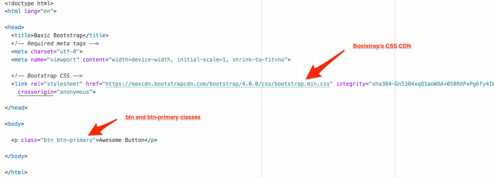
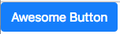
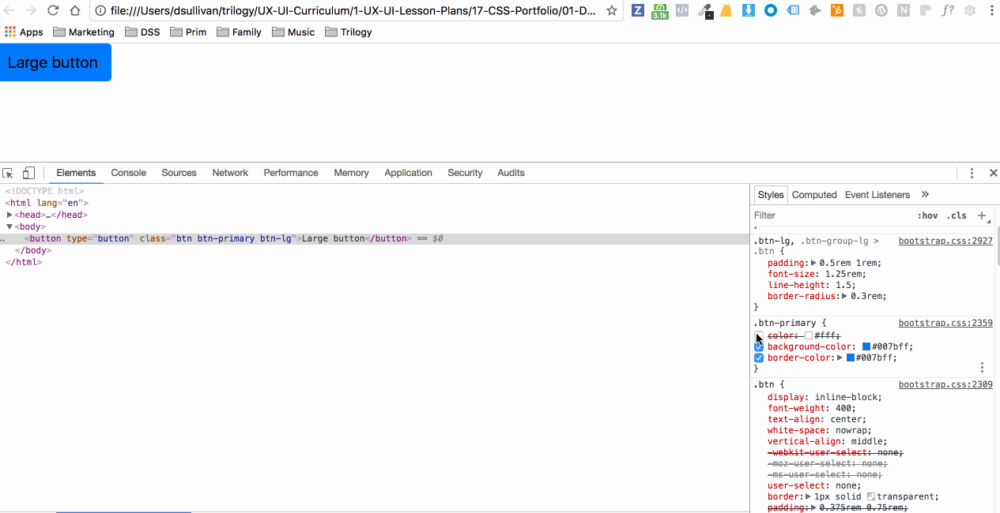
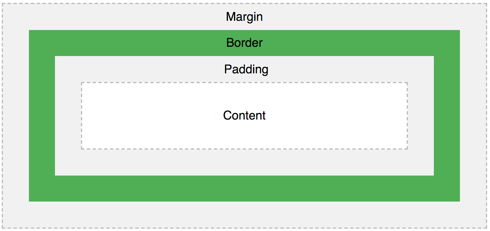
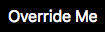
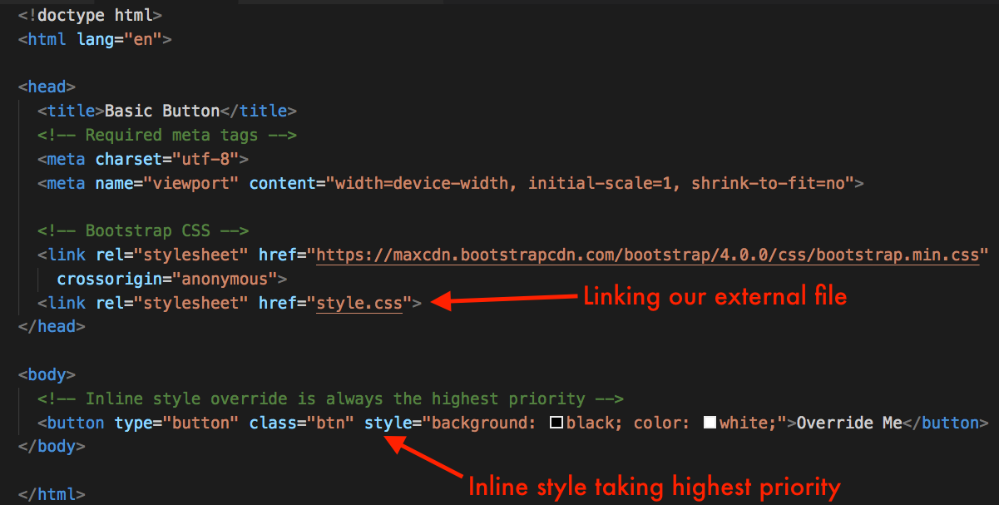
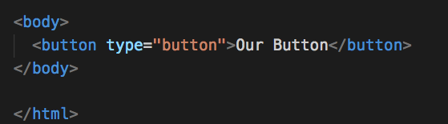

## 17.1 Lesson Plan - Bootstrap and the Box Model (6:30 PM)

### Overview

- In today’s class, students start to dive into Bootstrap! Throughout this week, we introduce additional CSS concepts through the lens of Bootstrap. Today’s main focus is the box model and pseudo-classes.

### Class Objectives

- Students will be able to articulate the value of frameworks and Bootstrap, and explain how they work.
- Students will be able to use Bootstrap CSS in their HTML files.
- Students will be able to use basic Bootstrap Components.
- Students will be able explain the priority of CSS rule sets.
- Students will be able to use the box model for manipulating the placement/sizing of HTML elements.
- Students will be able to write and use css pseudo-classes.

---

### Instructor Notes

- Welcome to week 17! CSS this week is going to feel very complex for many of your students - many developers don’t know it very well!

- Today’s class focuses in on a singular Bootstrap component (the button) to motivate discussion of new CSS concepts: namely the box model and pseudo-classes.

- Be sure to not just focus on the component itself, but prompt students to answer underlying questions about how that component works in basic HTML and CSS.

- As with most coding, you want to give students ample time to practice. The only real way to get better at coding is to write more code!

- Be sure to walk around to engage with students in groups as they work through activities.

- As always, have your TAs reference TimeTracker to help keep track of time during class.

- Use the [17.1 Slideshow](https://docs.google.com/presentation/d/18MLqad5JxV6-IjVSOl8TJCuZdk1LSmKHbRZAfjZD6qc/edit?usp=sharing) provided as an initial guide for today's class. Feel free to modify the slides slightly to fit your own style, but be sure to cover the same activities.

- Have your TAs reference [TimeTracker](TimeTracker.md) to help keep track of time during class.

---

### 1. Instructor Do: Why Bootstrap? (10 mins) (Critical)

- Let students know that we are now going to gain a high level overview of what Bootstrap is and how it helps us as UX/UI designers rapidly prototype.

- Tell them that you don't have to understand every single piece of Bootstrap to start using it, that would be very overwhelming.

- Instead, we are going to take a top down approach, where we implement a piece of Bootstrap and then breakdown exactly how it is working.

- In this next activity, students are going to look through popular Bootstrap sites to gain inspiration and see the possibilities of using Bootstrap.

**Instructions:**

- Slack out [https://bootstrapbay.com/blog/built-with-bootstrap/](https://bootstrapbay.com/blog/built-with-bootstrap/) and have the students choose some of their favorite sites from this list.
- Take a few minutes to discuss what they like about them from a UX/UI point of view.
- Let them know that with Bootstrap, they will be able to create layouts like this.

- When you are done, check to see if students understand how and why Bootstrap helps us as UX/UI designers.

---

### 2. Everyone Do: Basic Bootstrap Page and Classes (5 mins) (Critical)

**Files:**

- [Bootstrap Button Docs](https://getbootstrap.com/docs/4.1/components/buttons/)
- [Activity File](Activities/02_Evr_Basic_Button/button.html)

**Instructions:**

- Explain that in this activity we are going to learn how to include Bootstrap in our HTML webpage, giving us access to the built in Bootstrap classes and components.
- Let students know that first we will create a paragraph `p` and add a Bootstrap `.btn` class to see the power of Bootstrap's built in classes.
- Slack out the [Activity File](Activities/02_Evr_Basic_Button/button.html).
- As a class, add a `.btn` and `.btn-primary` class to our `p` tag, giving it Bootstrap button styling.

- 

- Have students open their `button.html` file in their browser to see the result.

    

- When you are done, check to see if students understand how to create a new `index.html` web page and include the Bootstrap framework.
- Also check to see if they understand how to implement Bootstrap classes as well as references specific styles defined in the built in Bootstrap CSS library.

---

### 3. Student Do: Pushing Your Buttons (10 mins) (Critical)

- The goal of this activity is for students to become more familiar with the Bootstrap syntax and overall concept that predefined classes can be pulled from the Bootstrap docs and used in mockups.
- As a beginner, these concepts can seem abstract and it can take a bit for them to sink in.
- This is a good time to check on the class to see if there are any holes in their learning.
- Do they understand how to create an HTML webpage, include Bootstrap and add a class?
- Don't hesitate to circle back on these topics.

**Files:**

  - [Bootstrap Button Docs](https://getbootstrap.com/docs/4.1/components/buttons/)
  - [Activities/03_Stu_Pushing_Buttons/Unsolved/pushing.html](Activities/03_Stu_Pushing_Buttons/Unsolved/pushing.html)

**Instructions:**

  - In this activity, students are going to use the Bootstrap button docs to add four new buttons to their webpage.
  - Slack out [Activities/03_Stu_Pushing_Buttons/Unsolved/pushing.html](Activities/03_Stu_Pushing_Buttons/Unsolved/pushing.html) to the class.
  - Instruct them to visit the [Bootstrap Button Docs](https://getbootstrap.com/docs/4.1/components/buttons/).
  - Have them copy four new buttons from the docs into their `pushing.html` file.
  - Have them open their `pushing.html` file in their browser to see the changes.
  - When you are done, check to see if students understand how to navigate the Bootstrap docs and add a Bootstrap class to an HTML element.

---

### 4. Instructor Do: Review Pushing Your Buttons (5 mins) (Critical)

- The goal of this review is get a feel for how the class is doing up till this point.
- Overall, do they understand the concept of Bootstrap and how to implement a Button?
- This is important because it will translate into more complex components and classes later in the unit.

**Files:**

- [Solved Pushing Button File](Activities/03_Stu_Pushing_Buttons/Solved/pushing.html)

**Instructions:**
  - Open the [Solved Pushing Button File](Activities/03_Stu_Pushing_Buttons/Solved/pushing.html) in VS Code and your browser.
  - First in VS Code, briefly go over the buttons and classes that are giving our HTML elements styling.
  - At this point students should feel comfortable with the overall concept of using built in classes, but make sure to check for understanding.
  - Next switch to your browser to demo the actual results.
  - If you are comfortable, open up your Chrome Developer Tools to demonstrate the styles that Bootstrap gives us through the built in classes that we have implemented.
  - If you are not comfortable with Chrome Developer Tools, you can share the gif below, pointing out that Bootstrap gives us padding, margin, border and a variety of other styles.



- At then end, check to see if students understand that our Bootstrap button classes have a lot of built in code that we can leverage.

---

### 5. Instructor Do: Box Model (10 mins) (Critical)

- In this activity, students will be introduced to the CSS box model.
- The box model is concept where all HTML elements can be considered boxes.
- Each box consists of margins, borders, padding, and the content inside the box.
- Bootstrap's components, like the button we have been implementing, provides box model attributes by default.
- We are now going to connect the dots as to how the classes work and how we can manipulate them.

**Files:**

- [Codepen Box Model Playground](https://codepen.io/dannysullivan/pen/xjeNRL)

**Instructions:**

  - The goal of this activity is to get students familiar with box model concepts.
  - The will have the ability to manipulate the attributes and watch them change on their screen.
  - Slack out the [Codepen Box Model Playground](https://codepen.io/dannysullivan/pen/xjeNRL).
  - Give them 5 - 10 minutes to play around with the styles.
  - Do students understand that the box model is a "concept" where all HTML elements are boxes that have margins borders, padding, and the content inside the box?
  - Do students understand that Bootstrap classes give us box model attributes by default?
  - Before moving on, check to see if they can answer these questions for you.



---

### 6. Student Do: Custom Box Model (15 mins) (Critical)

- In this activity, students will draw out a custom button on paper, using the box model, and then implement it in their code.
- Students will need pen and paper for this activity.

**Files:**

- [Unsolved Folder](Activities/04_Stu_Custom_Box_Model)
- [Codepen Box Model Playground](https://codepen.io/dannysullivan/pen/xjeNRL)

**Instructions:**

  - This activity will give students practice with the box model from a designer's perspective.
  - They will mock up a design on paper, then translate it into code.

**Part 1**

  - Hand out pencils and paper to your students, if they don't have them handy.
  - Instruct students that they will be drawing out a custom button, with box model attributes, by hand.
  - Their button should have a height and width and include margins, borders, padding, and the content inside the box.
  - They should draw out the exact dimensions of the button in pixels.
  - They can reference the [Codepen Box Model Playground](https://codepen.io/dannysullivan/pen/xjeNRL) if they need a refresher.

**Part 2:**

  - When students are finished with their drawings, Slack out the [Unsolved Folder](Activities/04_Stu_Custom_Box_Model).
  - Have them create their buttons via HTML and CSS.

- To wrap up, check if students understand how to implement the box model by using all of the attributes.

---

### 7. Instructor Do: Custom Box Model Review (10 mins) (Critical)

- This review should check to see if students understand the concepts of the box model and the attributes that are associated with it including margin, padding, border.

**Files:**

- [Solved Activity HTML](/Activities/04_Stu_Custom_Box_Model/Solved/customButton.html)
- [Solved Activity CSS](/Activities/04_Stu_Custom_Box_Model/Solved/style.css)


- **Instructions:**

  - Open the [Solved Activity](/Activities/04_Stu_Custom_Box_Model/Solved/customButton.html) file in VS Code and your browser.
  - First in VS Code, step through the [Solved Activity CSS](/Activities/04_Stu_Custom_Box_Model/Solved/style.css) file, identifying the box model attributes.
  - Next open [Solved Activity](/Activities/04_Stu_Custom_Box_Model/Solved/customButton.html) in your browser to demo the results.
  - In your `style.css` file, update the different styles to reinforce how the attributes interact with each other.
  - Do students understand the main concepts of the box model including all of the CSS properties used?

---

### 8. Break (15 mins)

---

### 9. Instructor Do: Slides - CSS Priority and Overrides (15 mins) (Critical)

- In this section, we are going to teach students two different ways to override their Bootstrap CSS, to create custom styles.
- Now that students have a grasp of how to implement Bootstrap buttons and implement a CSS box model, we are going to show them how to customize their Bootstrap components.
- First is through inline styles.
- Second is through an external stylesheet.

**Files**

- [Override Demo Files](Activities/05_Ins_Button_Override_Demo)

#### Demo Inline Styles

- In this activity, make sure to point out that while the inline styles always override any external style sheet, external style sheets are read in cascading fashion with later sheets overriding sheets loaded earlier.  For this reason, any custom external CSS should be linked after the Bootstrap CDN.

- Open [Override Demo Index](Activities/05_Ins_Button_Override_Demo/override.html) in your browser, point out that the button is currently black.

- Currently our Bootstrap `.btn` class is being overridden by an inline style, which you can see here.

```<button type="button" class="btn" style="background: black; color: white;">Override Me</button>```



#### Demo External Stylesheet

- Let's go ahead and remove that style, by deleting the code.
- Our button should now look like this:

```<button type="button" class="btn">Override Me</button>```

- Go ahead and refresh your browser, you will now see that the button is orange.


- How is this happening?
- Open up [Override Demo CSS](Activities/05_Ins_Button_Override_Demo/style.css) and demo the code, pointing out that this file has a `background: orange` rule defined for our button.



- Before moving on, check to see if the students understand how to implement an inline style.
- Also check if they understand that files in our `<head>` tag are read in order cascading downward.
- Lastly, do they understand that inline styles take priority over an external stylesheet?

---

### 10. Students Do: Overriding Styles (15 mins) (Critical)

- In this next activity, students will practice overriding a basic button through an inline style, then through an external stylesheet.
- This concept will translate into the bigger picture of customization when dealing with Bootstrap grids and components in later lessons.

**Files:**

- [Button Override Files](Activities/06_Stu_Button_Override/Unsolved)

**Instructions:**

- Slack out the [Button Override Files](Activities/06_Stu_Button_Override/Unsolved) files to the students.
- Instruct them that they are going to create two styles, one inline and one external.
- There currently are two buttons in [Activities/05_Ins_Button_Override/override.html](Activities/06_Stu_Button_Override/Unsolved/override.html).
- The first button, add the inline style directly into the element changing the `background-color`.
- For the second button, create a class, then reference the class in [Activities/06_Stu_Button_Override/Unsolved/style.css](Activities/06_Stu_Button_Override/Unsolved/style.css) and override the `background-color`, `color`, `padding`, `margin` and `border`.

- Make sure to check for understanding to see if students can the students successfully override HTML elements with inline styles and external styles.

---

### 11. Instructor Do: Review Overriding Styles (10 mins)

- The goal of this review is check whether students understand how to override and customize HTML elements, in this case buttons.

**Files:**

- [Solved Override Files](Activities/06_Stu_Button_Override/Solved)

**Instructions:**

  - Open [Activities/06_Stu_Button_Override/Solved/override.html](Activities/06_Stu_Button_Override/Solved/override.html) in your browser and demo the buttons.
  - Next. move into VS Code and walk students through the HTML syntax that we are using.
  - Point out that we are overriding our first button through our inline style and the second button is through our external stylesheet that is linked in our `<head>` tag at the top of the file.
  - Next, open up [Activities/06_Stu_Button_Override/Solved/style.css](Activities/06_Stu_Button_Override/Solved/style.css) to step through the CSS box model modifications.
  - At this point students should have a grasp on overrides and the syntax needed to customize HTML elements.
  - Feel free to update the code to reinforce how the styles interact with each other.

---

### 12. Instructor Do: CSS Pseudo-classes (10 mins) (Critical)

- In this section we will be introducing students to pseudo-classes. This will be the first time they modify and change the state of an HTML element, so it should be fun for them.
- There are a lot of pseudo-classes, but to keep things simple we are only going to focus on the most common `a` tag classes. Stay focused on the basics first so students understand the syntax and how pseudo-classes change the state of our elements.

**Files:**

  - [Pseudo-class Demo Files](Activities/07_Ins_Pseudo_Example)
  - [Pseudo-classes Docs](https://developer.mozilla.org/en-US/docs/Web/CSS/Pseudo-classes)

**Demo Pseudo-classes:**

- Open [Activities/07_Ins_Pseudo_Example/index.html](Activities/07_Ins_Pseudo_Example/pseudoClasses.html) in your browser as well as VS Code.
- In your browser, take a few minutes to hover and click our button.
- Ask students what do they notice?
- They should see that our button now has some life to it, changing colors on hover and click.
- These are our pseudo-classes changing the state of our HTML element.
- Now move into VS Code [Activities/07_Ins_Pseudo_Example/pseudoClasses.html](Activities/07_Ins_Pseudo_Example/pseudoClasses.html) to demo our HTML code.
- Point out that we have a simple `button` element with the text `Our Button`.



- Now open [Activities/07_Ins_Pseudo_Example/style.css](Activities/07_Ins_Pseudo_Example/style.css) in your VS Code editor.
- Take a few minutes to step through the CSS code.
- You should notice that there is a style for `link`, `hover`, `visited` and `active`.

```css
/* basic box model styles for our button */
button {
  background: fuchsia;
  color: white;
  padding: 20px;
  margin: 20px;
  border: 1px solid orange;
}

/* when the button is not clicked yet */
button:link {
  color: black;
}

/* when a user hovers the button */
button:hover {
  background: seagreen;
  color: white;
}

/* after the button is visited (clicked) */
button:visited {
  color: white;
  background: orange;
}

/* the color of the button while it's being clicked (activated) */
button:active {
  border: 1px solid;
  background: blue;
  color: white;
}

```

- These are different states that we are manipulating through our CSS code.
- This is a lot of new syntax, so take the time to see how the students are feeling about it.
- If necessary, go back through and manipulate the CSS to demonstrate how pseudo-classes work.
- They should begin to have an understanding how pseudo-classes are implemented, but it might take a few more times through for it to sink in so don't rush.

---

### 13. Students Do: Bootstrap Pseudo-classes (10 mins) (Critical)

- Students are now going to take the concepts from the previous demo and apply them to a Bootstrap button class. The overall goal is for them to customize Bootstrap components (buttons), so this is a necessary skill.
- Bootstrap is more complex under the hood compared to the custom CSS that we have been writing. For this reason, we are going to keep it basic, working with the same pseudo-classes as before. After students are comfortable in later lessons, we can add in more complex classes.

**Files:**

- [Pseudo-classes Docs](https://developer.mozilla.org/en-US/docs/Web/CSS/Pseudo-classes)

**Instructions:**

  - The objective for this activity is to customize Bootstrap pseudo-selectors.
  - This involves overriding Bootstraps default pseudo-classes and writing our own CSS.
  - This tests students knowledge of CSS priority, overriding the default `.btn` class and pseudo-selectors.
  - Slack out the [Unsolved Bootstrap Pseudo-classes](Activities/08_Stu_Bootstrap_Pseudo_Classes/Unsolved) files.
  - Open [Activities/08_Stu_Bootstrap_Pseudo_Classes/Unsolved/bootstrapPseudo.html](Activities/08_Stu_Bootstrap_Pseudo_Classes/Unsolved/bootstrapPseudo.html) in your browser and VS Code.
  - Open [Activities/08_Stu_Bootstrap_Pseudo_Classes/Unsolved/style.css](Activities/08_Stu_Bootstrap_Pseudo_Classes/Unsolved/style.css) in VS Code as well.
  - Notice there are currently no stylings on our Bootstrap `.btn` class.
  - Override the `.btn` class in the external `style.css` file.
  - Give your button a different `background`, `color`, `margin`, `padding` and `border` for each of the different states.
  - When you are done, open your `bootstrapPseudo.html` file in your browser.

---

### 14. Instructor Do: Review Pseudo-classes (10 mins) (Critical)

- The previous activity was culminating, bringing together the concepts of CSS priority, overriding styles and using pseudo-selectors.
- As a beginner, it's easy to get tripped up with syntax until your start to recognized the patterns.
- Ask the students how they felt about the activity, if they are comfortable with the concepts up until now.
- This material is not linear, so don't be afraid about circling back to the basics to reinforce the concepts.

**Files:**

- [Solved Bootstrap Pseudo-classes Files](Activities/08_Stu_Bootstrap_Pseudo_Classes/Solved)

**Instructions:**

- Open [Activities/08_Stu_Bootstrap_Pseudo_Classes/Solved/bootstrapPseudo.html](Activities/08_Stu_Bootstrap_Pseudo_Classes/Solved/bootstrapPseudo.html) in your browser as well as VS Code.
- First in your browser, demo the different states that our pseudo-classes are manipulating by hovering and clicking our button.
- Next move into VS Code to dissect your [style.css](Activities/08_Stu_Bootstrap_Pseudo_Classes/Solved/style.css) file.
- Take a few minutes to comment out each rule, flip to your browser, refresh and demo the page.
- You want to reinforce exactly what each pseudo-class is doing.
- The hardest part for students will be the syntax, so take the time to carefully step through it.
- Check to see if the students firmly grass how to override Bootstrap styles with pseudo-classes.

**Bonus**

- Have students add two more pseudo-classes to their buttons using [Pseudo-classes Docs](https://developer.mozilla.org/en-US/docs/Web/CSS/Pseudo-classes).
- This can be an opportunity for them to experiment and see how you can manipulate state with just CSS.

---

### 15. Students Do: Customize Buttons (20 mins) (Critical)

**Overview:**

- In this activity, students will have the opportunity to step out side the box and get really creative with their buttons.
- Encourage them to use the docs and experiment.
- They should include all of the necessary box model attributes, but tell them not stop stop there.
- There are a lot more attributes that you can modify using CSS and pseudo-classes so students should feel free to experiment.

**Files:**

  - [Customize Button Files](Activities/09_Stu_Customize_Buttons)
  - [Fancy Buttons](https://codepen.io/collection/bxdaH/)

**Instructions:**

  - The goal of this activity is for students to use their new CSS skills and have fun while creating a "suite" of button styles.
  - Slack out [Fancy Buttons](https://codepen.io/collection/bxdaH/) and encourage students to find a few buttons they like.
  - They are going to use these as inspiration for their new button "suite".
  - Next Slack out [Customize Button Files](Activities/09_Stu_Customize_Buttons).
  - Students are free to create any type of button(s) that they would like.
  - At the end, tell them to take a screen shot and share it in Slack.

---

### 16. Students Do: Demos and Critiques (10 mins) (Critical)

**Overview:**

- In this section, students will share and demo what they've created.
- First ask for a volunteer, but if you have to then pick someone at random.
- Let students know that everyone is going to share.
- The goal is to start a discussion about what they learned, found challenging and found fun.

---

### Copyright

Trilogy Education Services © 2018. All Rights Reserved.
