## 17.2 Lesson Plan - Bootstrap Components and Grids (6:30 PM)

### Overview

- Today, student will dive into Bootstrap's grid system (just for desktop now).  Students will practice building out complex UIs without any CSS, making their prototyping much faster.

---

### Class Objectives

- Students will be able to incorporate and organize multiple bootstrap components into a single page.

- Students will be able to debug failed CSS overrides by using knowledge of CSS specificity and advanced CSS selectors.

- Students will be able to implement bootstrap grids.

- Students will be able to use nested grids.

---

### Instructor Notes

- Welcome to week 17 day 2! Today we are going to discuss additional bootstrap components, the value of Bootstrap's grid system, and more ways to customize layout.

Use the [17.2-Advanced-CSS-with-Bootstrap.pptx](https://drive.google.com/open?id=1OgFjR-lOWxfvkd6nuidgLbRYZefMLpAzFanMRKMD7kk) provided as an initial guide for today's class. Feel free to modify the slides slightly to fit your own style, but be sure to cover the same activities.

- The bulk of today will be spent investigating a few CSS concepts in the context of Bootstrap.

- As with most coding, you want to give students ample time to practice. The only real way to get better at coding is to write more code!

-Be sure to walk around to engage with students in groups as they work through activities.

- As always, have your TAs reference the [TimeTracker](TimeTracker.md) to help keep track of time during class.

---

### 01. Students Do: Daily UX Challenge Custom Progress (15 mins) (Critical)

Students start the day by customizing a Bootstrap progress bar similar to how they customized buttons on the previous day.  Make sure you and your TAs walk around during this activity to gauge how much review of the CSS concepts are necessary before the following critique.

- **Files**

  - [01-Stu_ProgressChallenge/progress.html](Activities/01-Stu_ProgressChallenge/Unsolved/progress.html)

  - [01-Stu_ProgressChallenge/style.css](Activities/01-Stu_ProgressChallenge/Unsolved/style.css)

- **Instructions**

  - [01-Stu_ProgressChallenge/README.md](Activities/01-Stu_ProgressChallenge/README.md)

### 02.  Instructor Do: Critique of Daily Challenge (15 mins) (Critical)

- Answer any remaining questions on the technical aspects of customizing.

- Randomly select 3-5 students to share their designs for critique using
[a randomizer](https://www.switchboard.tech/randomizer).

- An example solution has been provided in the [01-Stu_ProgressChallenge/Solved](Activities/01-Stu_ProgressChallenge/Solved) folder. For instructor reference, the code is explained below.

  - The class `progress-bar-striped` was added to the `
` already having the `progress-bar` class. This resulted in the striped effect on the progress bar.

    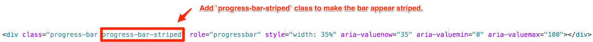

  - Other bootstrap utilities could have also been used such as adding `bg-success` to change the color to green.

  - Additional HTML adjustments could be changing the width of the progress or adding a label.

    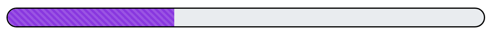

  - The external CSS file, [01-Stu_ProgressChallenge/Solved/style.css](Activities/01-Stu_ProgressChallenge/Solved/style.css), alters the outer part of the progress bar (the `progress` class) by giving it a border, changing the height and width, and adding a margin. (A `border-radius` of half the height results in the ends appearing as semi-circles.)  It also changes the color of the progress by altering the `progress-bar` class's background color.

    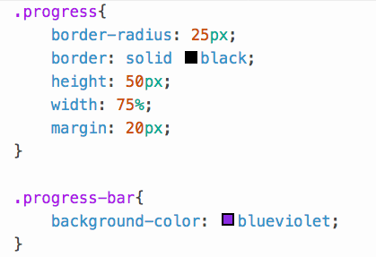

### 03. Instructor Do: Discuss and Demo More Bootstrap Components (5 mins) (Critical)

- Visit [Bootstrap Components](https://getbootstrap.com/docs/4.0/components/alerts/), and use the navigation menu on the left to show students some common bootstrap components.

  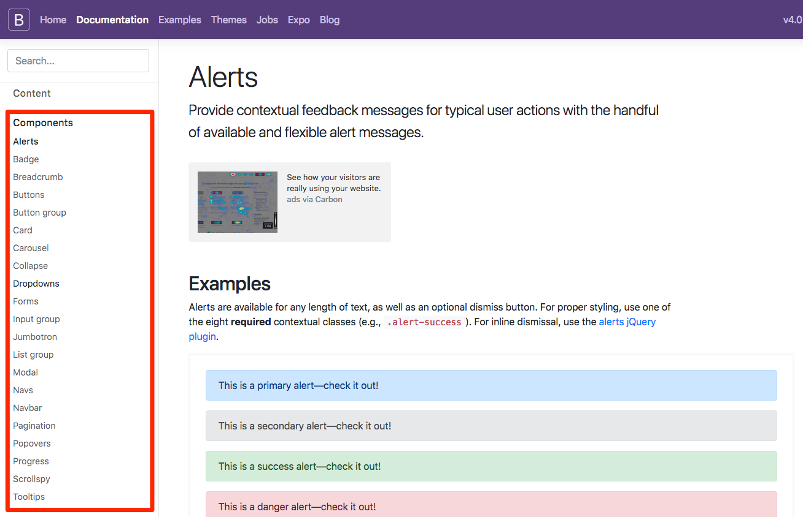

- Explain that adding any of these components is as easy as copying and pasting the source code provided.  This allows students to quickly build a page while minimizing the amount of HTML and CSS they have to write.

- Live code a page by adding these components. A sample page is provided for you: [02-Ins_BootstrapComponents/Solved/components.html](Activities/02-Ins_BootstrapComponents/Solved/components.html). It is important that you live code by copy and pasting to demonstrate how easy it is to add the components.

  - Create a new HTML file and add the Bootstrap CSS CDN to the header or open [02-Ins_BootstrapComponents/Unsolved/components.html](Activities/02-Ins_BootstrapComponents/Unsolved/components.html).

  - Go to [Bootstrap's Jumbotron Page](https://getbootstrap.com/docs/4.0/components/jumbotron/), copy the code there, and paste it into `<body>` tag in VS Code.

  - Show the page in the browser.

    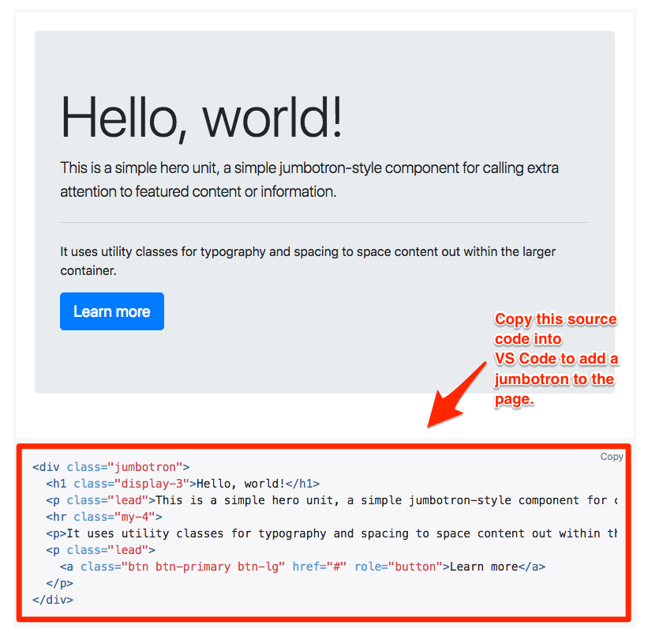

  - Follow the same process for the card and navbar components.

  - Make sure to update the page in browser after each additional component.

    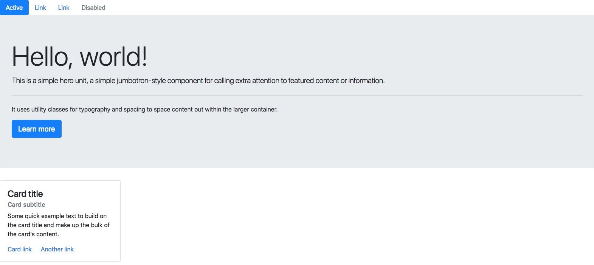

### 04. Everyone Do: Simple Bootstrap Layout Using VSCode Snippets (10 mins) (Critical)

- Have students follow along as you create a blank HTML file in VS Code.

- Download Bootstrap 4 snippets.

  - Click the `Extensions` button.

  - Type "Bootstrap 4" in the search bar.

  - Choose the first option by Ashok Koyi.

  - Click `Install` and then `Reload`.

    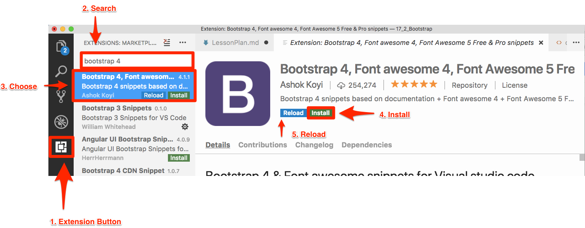

- Create an HTML page using Bootstrap 4 snippets.

  - Begin by typing "b4-". A list of options appears. Choosing the first option, `b4-$` will set up the master Bootstrap HTML template complete with Bootstrap's CSS CDN and the optional JavaScript CDNs. These CDNs allow some interactive elements, like dropdown menus and collapsing elements, to work.  More information about how they work will be covered later in the course. Students can leave them there since they will allow some of the "off the shelf" components to work correctly.

    

  - To add a navbar, type b4-nav. A list of options appear. Choose `b4-navbar-a`.  When the code appears, explain that the navbar code can be complicated and students should always reference the documentation. Note that some words are highlighted. These should be looked over for user action or confirmation.

  - Notice in the `justify-content-center|justify-content-end` class in the `<nav>` opening tag. Whenever `|` appears, the user should pick one or none of the choices. In this example, deleting both results in the content appearing to the left, the `justify-content-center` will center the content of the nav bar, and `justify-content-end` will place the nav bar content to the right.

  - Stress that in some cases it is easier to copy and paste from the Bootstrap documentation. At the least, many components will require that you visit the documentation when using snippets.

  - Show students the result in the browser.

  - Now, add a jumbotron using snippets.  Type "b4-jumbotron-default".

  - Before showing students the result in the browser, let them know that pressing `Shift+Alt+F` will format their HTML code automatically. Demo this in the text editor.

    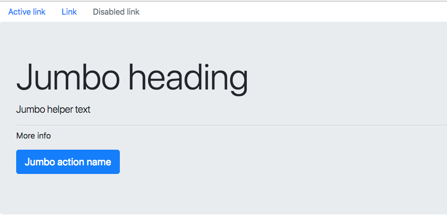

### 05. Partners Do: Explore More Bootstrap Components (15 mins) (Critical)

- In this activity, students work in pairs to explore the Bootstrap Documentation and implement more Bootstrap components using the source code in the documentation or VS Code snippets. Students can use the file they created in the last activity.  A version of that file is provided below for students who might have fallen behind.

- Make sure that you and your TAs walk around to ensure that everyone has successfully installed the extension from the previous activity and provide student guidance.

- **File**

  - [04-Par_BootstrapComponents/exploreComponents.html](Activities/04-Par_BootstrapComponents/Unsolved/exploreComponents.html)

- **Instructions**

  - [04-Par_BootstrapComponents/README.md](Activities/04-Par_BootstrapComponents/README.md)

### 06.  Instructor Do: Review Bootstrap Components (10 mins) (Critical)

- A solved version, [04-Par_BootstrapComponents/exploreComponents.html](Activities/04-Par_BootstrapComponents/Solved/exploreComponents.html), is provided for reference. Please use the unsolved version, [04-Par_BootstrapComponents/exploreComponents.html](Activities/04-Par_BootstrapComponents/Unsolved/exploreComponents.html), in order to live code each component as students offer the components they explored.

- Ask students to volunteer the bootstrap components they added to their page.  Add each component by live coding, and discuss its use cases.

- Make sure to show the components in the browser after each iteration.

- Discuss that prototyping with only bootstrap components won't be possible without some organization of components. For example, you wouldn't likely see the card component stacked one on top of the other. How might this be fixed?

### 07. Instructor Do: CSS Groups and Advanced Selectors (10 mins) (Critical)

- Open [05-Ins_ComplexSelectors/advSelectors.html](Activities/05-Ins_ComplexSelectors/Solved/advSelectors.html) in a browser window.  Explain to students that this page is written using pure HTML (no bootstrap).

- Slack out [05-Ins_ComplexSelectors/advSelectors.html](Activities/05-Ins_ComplexSelectors/Unsolved/advSelectors.html) to students. This is HTML of the page you are currently displaying, but without the CSS.  Ask them to identify elements that have been styled using CSS.

  - Two elements, a `h1` and `p`, have been centered using `text-align: center`.  The `p` element has also been italicized.

  - The links at the top of the page have had their color changed. Point out that the bottom link has not changed.

  - `text-decoration: underline` has been added to headings.

  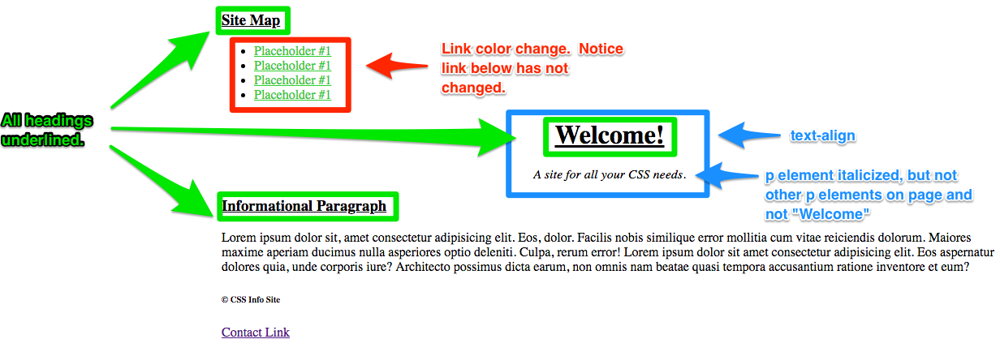

- Ask students how they might go about styling these elements using CSS. Note that some of the same element tags have been styled differently. Students might respond that they could add classes or IDs and style those. While this is a good answer, explain that using some advance selection techniques can organize and shorten their CSS code.

- Open [05-Ins_ComplexSelectors/style.css](Activities/05-Ins_ComplexSelectors/Solved/style.css) and walk through each part of the code and its benefits.

  - Students have likely noticed CSS groups in other solution files. Explain that, rather than styling `h1` and `h3` elements separately, styling can be applied to many elements, classes, and/or IDs by separating them with a comma. This allows styling of elements at once.

    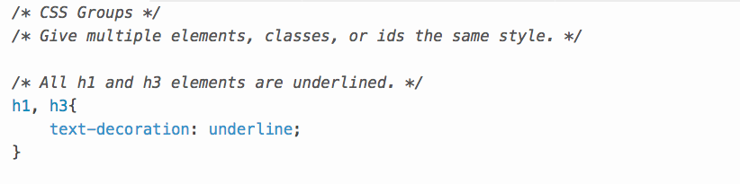

  - Explain that a descendant selection can be used to style elements inside of other elements. Use a space to separate, e.g. `nav a {`.

  - Show that some links on the page are selected/styled (links in nav), while others are not (link at the bottom).

    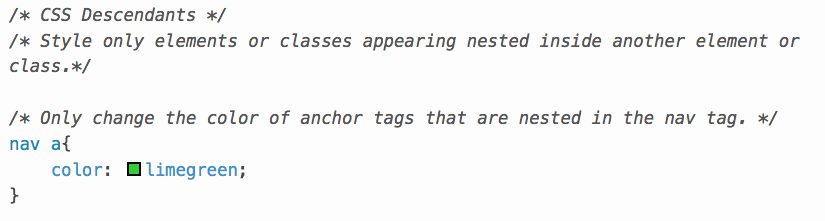

  - Explain that specific elements within a class can be selected by "chaining" selectors.

  - Here, only `p` elements with the class `welcome` are selected. Here, all the text is center aligned by selecting the welcome class, but only the paragraph elements are italicized.

    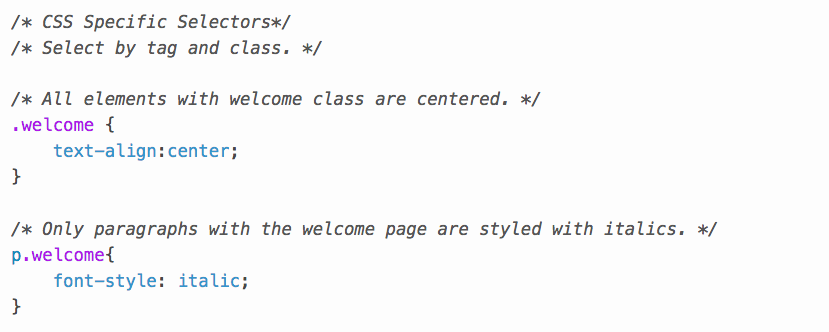

### 08. Everyone Do: Broken Bootstrap Overrides (10 mins) (Critical)

- Open [06-Env_BrokenOverrides/advSelectors.html](Activities/06-Env_BrokenOverrides/Solved/advSelectors.html) and [06-Env_BrokenOverrides/style.css](Activities/06-Env_BrokenOverrides/Solved/style.css) in VS Code and slack the files out to students but do not open the HTML file in the browser. Instruct students to do the same.

- Intentionally lead students down the wrong path here to introduce CSS specificity:

  - Ask volunteers to explain the changes that the CSS is making to the HTML elements.

  - It looks like all `p` elements should be dark turquoise and bold.

  - It also appears that the text color of the button should be turquoise with a slate gray background.

  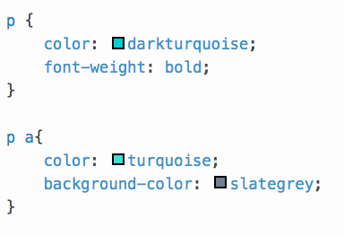

- Open [06-Env_BrokenOverrides/advSelectors.html](Activities/06-Env_BrokenOverrides/Solved/advSelectors.html) in a browser.

  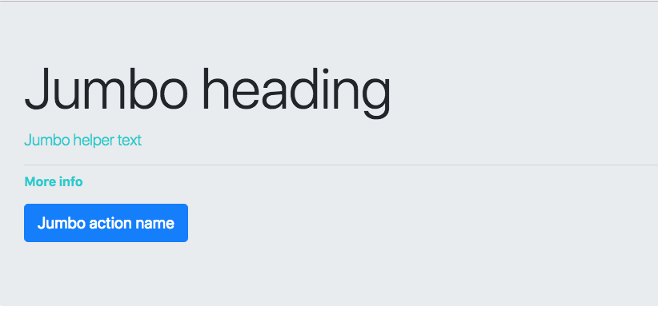

- Use slides 3-5 to go over CSS specificity.

  - CSS styling order depends highly upon the specificity of the selector. This means that the more specific a selector is, the more likely it is to overwrite styles with less specific selectors. So in this example tags come first, then classes, then IDs.

  - Specificity is the order by which the browser decides which CSS styles will be displayed.

  - A style attribute stored within the HTML tag (inline CSS) is the most specific, followed by IDs, classes (including pseudo-classes and attributes), and finally elements and pseudo-elements.

- Review the code on the "What Color Am I?" slide and ask the class what color the CSS will render according to these rules.

  - The outcome of these CSS rules is that the element will be colored blue since the id selector is of greater specificity than the tag or class selector.

  - Let students know that in general CSS should not be written as seen in this example but rather from least to most specific so that later styling takes precedence over earlier styling.

- Since bootstrap uses classes often, students will likely be overriding those class stylings, but once in awhile knowing some advanced selection techniques is helpful.

- Additionally, since later classes of the same specificity will override earlier classes, students must make sure they are styling the correct class for an effective override.

- Discuss what went wrong in the case of our broken CSS.

  - Some `p` elements had the `lead` class.  Open [Bootstrap's CSS CDN](https://maxcdn.bootstrapcdn.com/bootstrap/4.0.0/css/bootstrap.css) and use `Command+F` (Mac) or `Ctrl+F` to search for `.lead`. The styling looks as follows:

    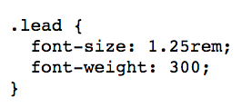

  - Since the `lead` class already specifies font-weight and classes win over tags the `font-weight` property in our code has no effect on `p` elements with the class `lead`.  However, the `lead` class does not have a `color` property so all `p` elements on the page with the exception of the button text are now blue.

  - The attempt to override any `a` tag descendants of `p` failed. Why? The `btn-primary` tag has both `color` and `background-color` properties. Since classes have a greater specificity, the code has no effect.

    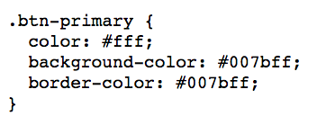

  - Sometimes making overrides to Bootstrap styling takes a few tries, but knowing about specificity and advanced selectors can help speed up trial and error.

### 09. Students Do: Fixing Broken Overrides (5 mins) (Critical)

- In this activity, students will alter the broken CSS overrides so they work as expected. Students should think critically about how their a page might look "big picture" and adjust the HTML and styling accordingly.

- If students have already been provided with the files from the last activity, they can use those. Otherwise, the file links are below.

- **Files**

  - [07-Stu_FixOverrides/advSelectors.html](Activities/07-Stu_FixOverrides/Unsolved/advSelectors.html)

  - [07-Stu_FixOverrides/style.css](Activities/07-Stu_FixOverrides/Unsolved/style.css)

- **Instructions**

  - [07-Stu_FixOverrides/README.md](Activities/07-Stu_FixOverrides/README.md)

### 10. Instructor Do: Review Fixing Broken Overrides (5 mins) (Critical)

- There are many answers to this activity. Ask for student volunteers to share their answers.

- Use the sample solution, [07-Stu_FixOverrides](Activities/07-Stu_FixOverrides/Solved), to guide discussion.

- Highlight the following:

  - The CSS selects the paragraph elements in the jumbotron by using descendants. By using a class and an element, the specificity is increased.

  - The paragraph elements inside the jumbotron are selected but other paragraph elements on the page are not.

    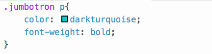

  - The button is styled by first removing the `btn-primary` class from the HTML tag since it controls color and background color.

  `.btn` is used as the selector. This has a higher specificity than `p a`.

    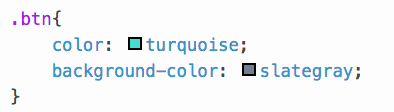

  - For the bonus, the pseudo-class `:hover` is used, the `color` and `background-color` are adjusted, and a `box-shadow` property is added.

    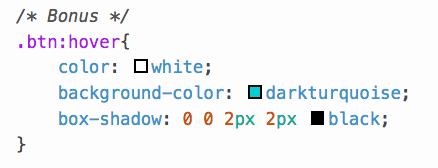

---

### 11. BREAK (15 mins)

---

### 12. Instructor Do: Intro to Bootstrap Grid (Slides 6-8) (5 mins) (Critical)

- Use slides 6-8 as an introduction to Bootstrap's grid system.

- Explain that bootstrap provides a set of classes to help with layouts. This is known as the Bootstrap grid. It allows a developer to easily place components on the page.

- Bootstrap's grid system has three basic classes. A container, rows, and columns.

- Using the image on slide 8, explain the grid system.

  - The border around the image is the container's border.

  - Rows are nested inside of the container. Each row is highlighted in yellow.

  -In this case, there are ten rows, but the number of rows you can use are unlimited.

  - Columns are nested in the rows. The columns in the image are highlighted in blue.

  -The rows are split into 12 units called columns. These units are grouped together to control column width.

  - The text in each column shows the class used. For example, if you want to break the row into 4 equal columns, use `col-3`. To break the row into a 9:3 ratio, use `col-9` and `col-3`.

  - All column classes must add to a maximum of 12.

    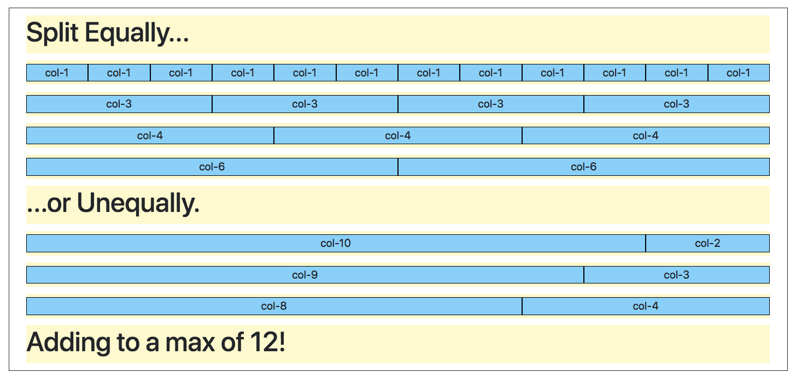

  - Use the next slide to show students the code next to the output. Point out:

    - The container wraps the entire grid.

    - The rows are direct descendants of the container.

    - The column classes are nested inside each row.

    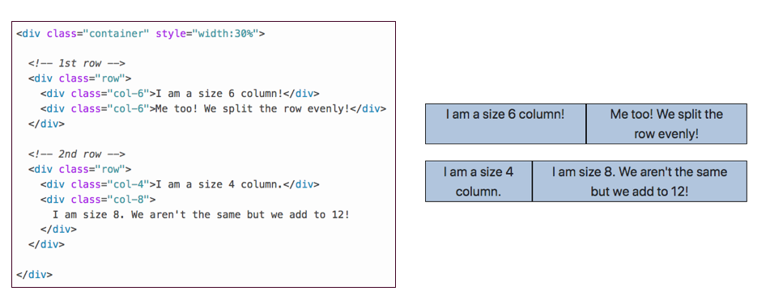

### 13.  Everyone Do: Basic Grid (10 mins) (Critical)

- In this activity, students will code along to create a website using Bootstrap's grid.

- Open and slack out [08-Evr_BasicGrids/basicGrid.html](Activities/08-Evr_BasicGrids/Unsolved/basicGrid.html). This file has a jumbotron and footer included.

- Explain to students that they will be adding card components to the page using the grid system.

- Feel free to use the solution, [08-Evr_BasicGrids/basicGrid.html](Activities/08-Evr_BasicGrids/Solved/basicGrid.html), as reference but be sure to live code along with students.

  - First, wrap the jumbotron content in a container.

  - This allows the jumbotron content to be aligned with the container that will hold the cards.

    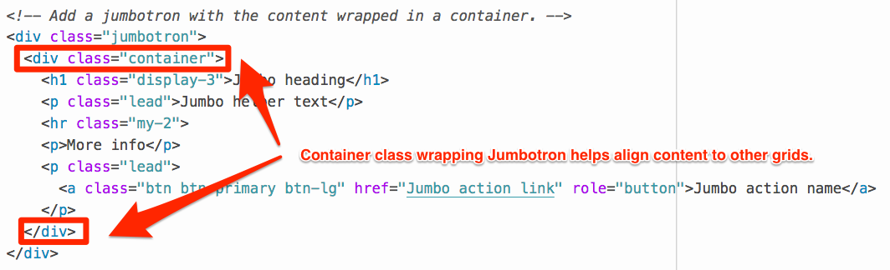

  - Then, add a `div` with the `container` class.

  - This can be done by typing `div.container` and hitting `TAB` or `ENTER`.

    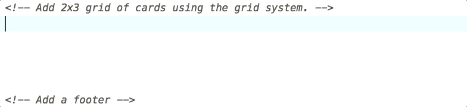

  - Inside of the `container`, add a 2 rows by typing `div.row*2` and then `ENTER` or `TAB`.

    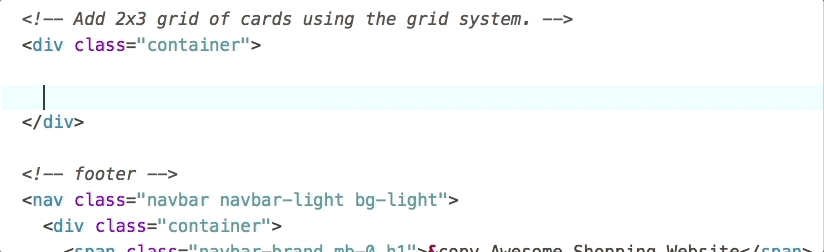

  - In each row, add 3 columns of equal width.

  - Remind students that since there will be 3 cards in each row, the column size will be `12/3=4`.

    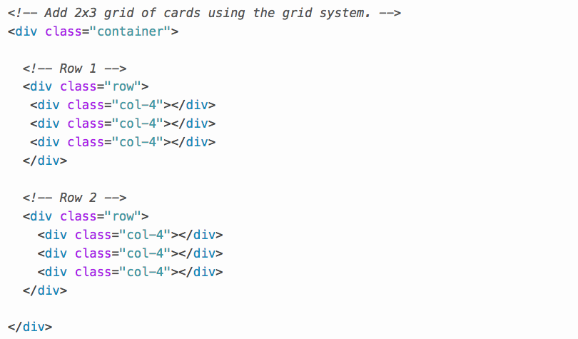

  - Copy and paste the source code for the example card from the bootstrap website into a column.

  - Remove `style="width: 20rem;"

  - Replace `...` in the `src` attribute with `http://via.placeholder.com/350x200`.

    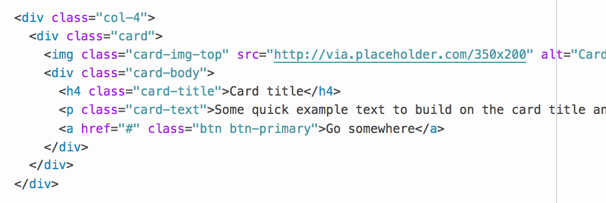

  - Then, copy and paste the card div into each column.

  - Format the code using the `Shift+Alt+F` shortcut.

  - Show students the result in the browser.

    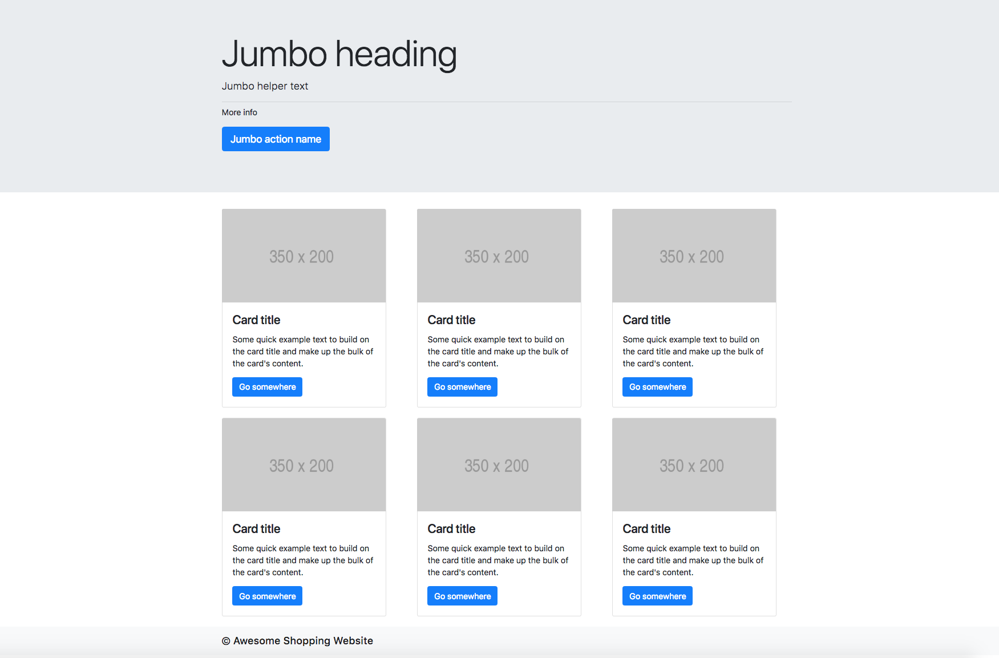

### 14. Instructor Do:  Nested Grids (Slides 10-13) (5 mins) (Critical)

- Go over slides 10-13 to introduce students to nested grids.

  - Let students know that Bootstrap grid can be extended (or nested) to allow for more control of layout.

- Go over how the nested grid works.

  - In each column, an unlimited number of rows can be added.

  - In each row, the columns can again be split adding to a max of twelve.

- Ask students to partner up and discuss how many rows and columns are in the image below. After a few minutes go over the answer.

  - There are 2 rows.

  - The first row has three columns of size 4.

  - The second row has 2 columns. One of size 4 and the other of size 8.

  - In the size 4 column, there are two rows.

  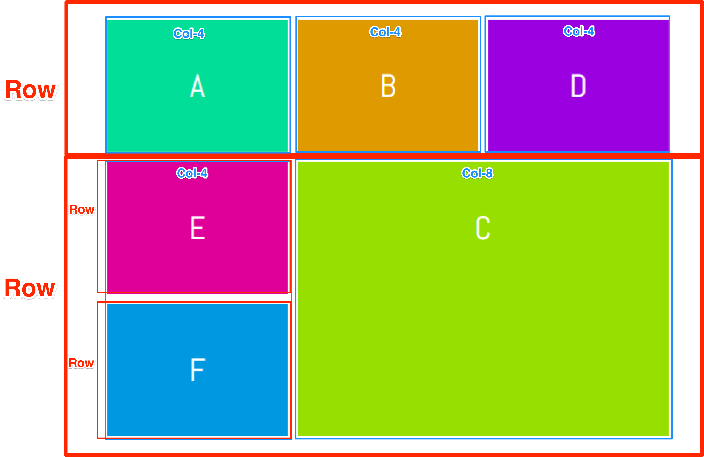

### 15. Students Do: Nested Grid Challenge (30 mins) (Critical)

- In this activity, students are challenged to create a layout from an image.

- They will need to use bootstrap components, nested grids, and custom CSS.

- If students finish early, they can customize the components to match the aesthetic of the progress bar designed earlier as part of the bonus activity.

  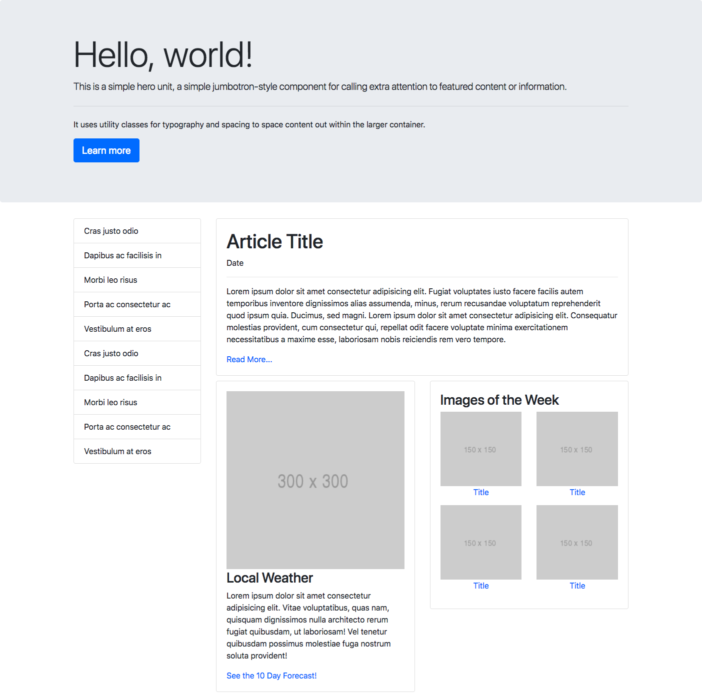

- **Files**

  - [09-Stu_NestedGirds/nestedGrids.html](Activities/09-Stu_NestedGirds/Unsolved/nestedGrids.html)

  - [09-Stu_NestedGirds/style.css](Activities/09-Stu_NestedGirds/Unsolved/style.css)

  - [09-Stu_NestedGirds/nestedGridLayout.png](Activities/09-Stu_NestedGirds/Unsolved/nestedGridLayout.png)

- **Instructions**

  - [09-Stu_NestedGirds/README.md](Activities/09-Stu_NestedGirds/README.md)

### 16. Everyone Do: Review Nested Grid Layout (15 mins) (Critical)

- Allow students to share how they used nested grids and custom CSS to recreate the given layout.

- If time remains, allow students who participated in the bonus to present their customization of the page.

- The following is an explanation of the sample solution, [09-Stu_NestedGirds/Solved](Activities/09-Stu_NestedGirds/Solved).

  - The jumbotron content is wrapped in a container to align it with the other content on the page.

  - The "main" content is wrapped a `container` class and one outer `row`.

  - `col-3` is used for the navigation list (a Bootstrap list group).

  - The section to the right is created using a `col-9` class. The remainder of the content is nested in this div.

    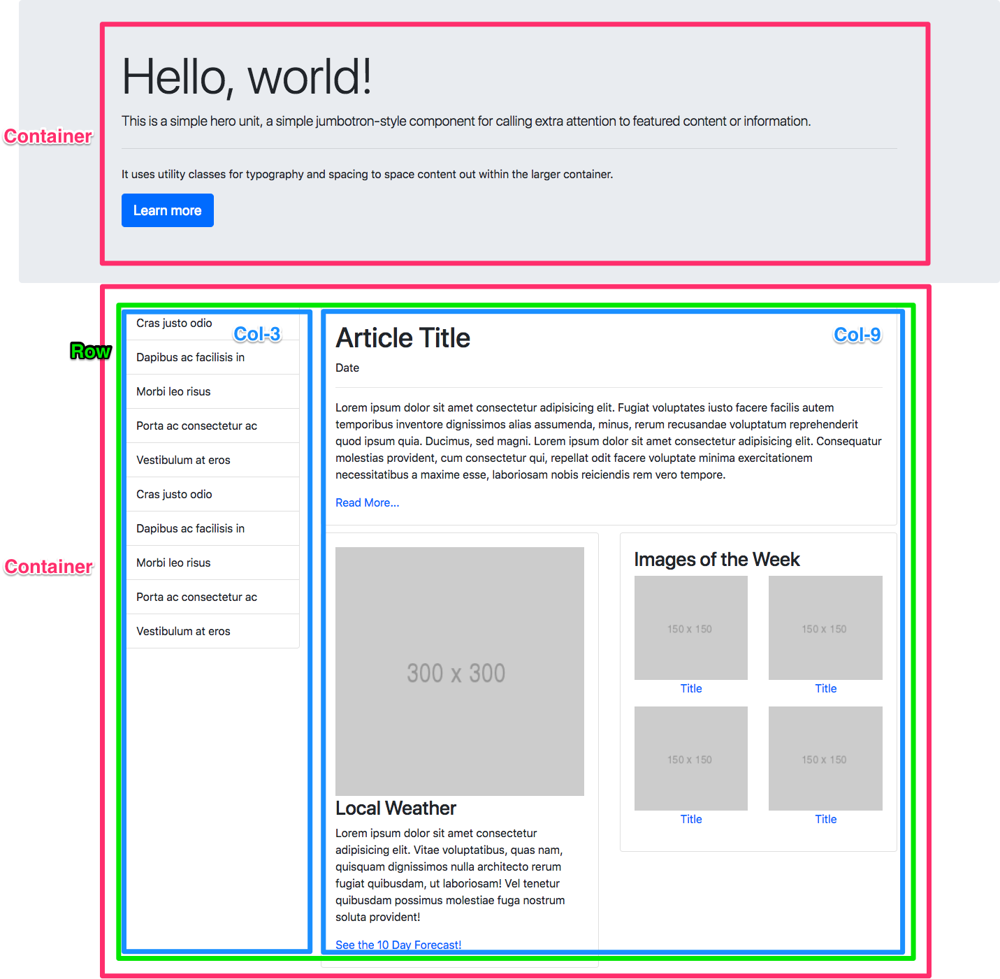

  - Inside the `col-9` class three rows are used.

  - The first row has a `col-12` class.

  - The second row has two `col-6` classes.

    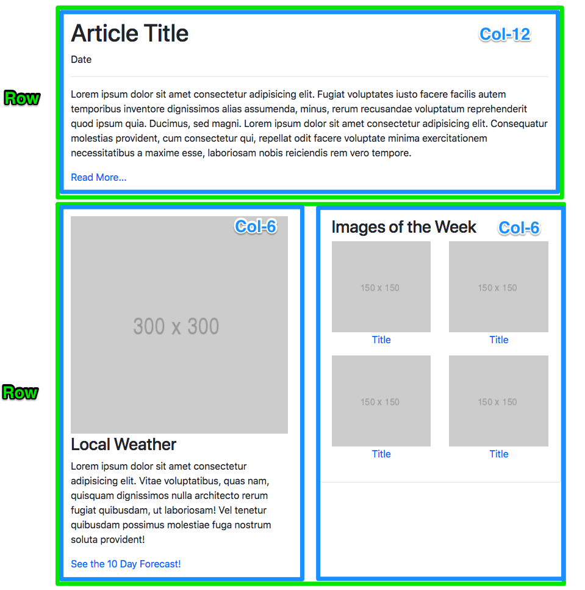

  - After the heading on the "Images of the Week" card, there are two rows. Each row has two `col-6` classes in it.

    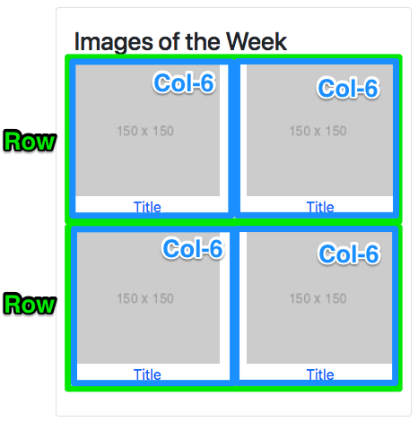

- Open the CSS file.

  - The CSS of the `card` class has been adjusted so that the margin is wider between each row of cards.

  - The images are sized using CSS. This allows to images to span the div and adjust the height to scale.

  - The class, `center` is added to the columns to center the hyperlink text.

    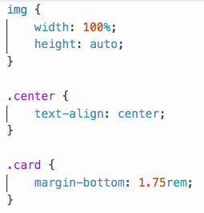

### 17. END (0 mins)

---

# LessonPlan & Slideshow Instructor Feedback

- Please click the link which best represents your overall feeling regarding today's class. It will link you to a form which allows you to submit additional (optional) feedback.

- [:heart_eyes: Great](https://www.surveygizmo.com/s3/4346059/UX-UI-Instructor-Feedback?section=17.2&lp_useful=great)

- [:grinning: Like](https://www.surveygizmo.com/s3/4346059/UX-UI-Instructor-Feedback?section=17.2&lp_useful=like)

- [:neutral_face: Neutral](https://www.surveygizmo.com/s3/4346059/UX-UI-Instructor-Feedback?section=17.2&lp_useful=neutral)

- [:confounded: Dislike](https://www.surveygizmo.com/s3/4346059/UX-UI-Instructor-Feedback?section=17.2&lp_useful=dislike)

- [:triumph: Not Great](https://www.surveygizmo.com/s3/4346059/UX-UI-Instructor-Feedback?section=17.2&lp_useful=not%great)

---

### Copyright

Trilogy Education Services © 2018. All Rights Reserved.
