## 17.3 Lesson Plan - Bootstrap Prototyping (10:00 AM)

### Overview

In this class, students will continue customizing bootstrap components and will build a prototype of an existing webpage.

---

### Instructor Notes

- Use the [17.3-More-Bootstrap.pptx](https://docs.google.com/presentation/d/1lRRd1UkaHzkKconvMLkft0I3-T59whkvCfpBWXRsmuM/edit?usp=sharing) slide show provided as an initial guide for today's class. Feel free to modify the slides slightly to fit your own style, but be sure to cover the same activities.

- Have your TAs reference [03-Day-TimeTracker](TimeTracker.md) to help keep track of time during class.

---

### Class Objectives

- Students will be able to continue customizing Bootstrap components.

- Students will be able to use bootstrap utilities as an alternate to custom CSS.

- Students will be able to create a layout using justify and align Bootstrap classes.

- Students will be able to create a complete prototype using Bootstrap.

- Students will work on project 3 user insights.

---

### 01. Students Do: Daily UX Challenge Custom Alerts (10 mins) (Critical)

- Let students know that they are starting the day by customizing a bootstrap alert. This allows them to continue practicing overriding Bootstrap CSS.

- Make sure you and your TAs walk around to help with any of the technical aspects of customizing the CSS.

- **Files**

  - [01-Stu_AlertChallenge/alert.html](Activities/01-Stu_AlertChallenge/Unsolved/alert.html)

  - [01-Stu_AlertChallenge/style.css](Activities/01-Stu_AlertChallenge/Unsolved/style.css)

- **Instructions**

  - [01-Stu_AlertChallenge/Unsolved/README.md](Activities/01-Stu_AlertChallenge/README.md)

### 02. Instructor Do: Review Custom Alerts (5 mins) (Critical)

- Ask students to volunteer the CSS properties used to customize their alert.

- An example solution has been provided in the [01-Stu_AlertChallenge](Activities/01-Stu_AlertChallenge) folder. For instructor reference, CSS properties with which students may be unfamiliar are explained below.

  - In this example, the `box-shadow` property has horizontal and vertical offsets, a blur radius, a spread radius, and color. A horizontal and vertical offset of 0 will make the shadow shown shown all around the box. The blur radius controls how blurry the shadow is and the spread radius controls the size of the shadow.

  - `display: inline-block` is used to fit the alert to the inner content.

  - A `:hover` pseudo-class is used on the hyperlink to change the text color and add a shadow to the text upon hover. `text-decoration` is set to `none` to override Bootstrap's CSS of adding an underline upon hover.

  - The `text-shadow` property as horizontal and vertical offsets, a blue radius, and a color. See [W3Schools - Text Shadow](https://www.w3schools.com/cssref/css3_pr_text-shadow.asp) for more information.

    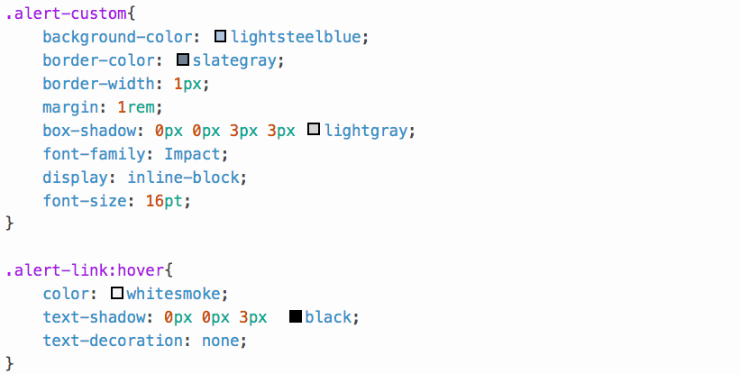

    

### 03. Everyone Do: Intro to Bootstrap Utilities (10 mins) (Critical)

- Explain to students that Bootstrap utility classes can be used as an alternate to CSS overrides. This activity will help them understand using justify and align utility classes in future activities.

- Open [02-Ins_BootstrapUtilities/alert.html](Activities/02-Ins_BootstrapUtilities/Solved/utilities.html) in a browser.

  - Point out that the alert now appears to be peeking out of the right side of the page.

  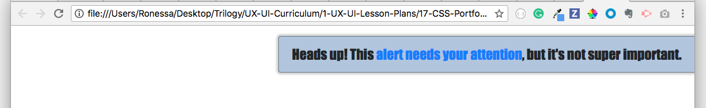

- Slack out the solved folder, [02-Ins_BootstrapUtilities](Activities/02-Ins_BootstrapUtilities/Solved/), and the link to the [Bootstrap Utilities documentation](https://getbootstrap.com/docs/4.0/utilities/borders).

- Have students discuss unfamiliar classes found in the HTML in pairs. Then, they should look to Bootstrap's Utilities documentation to find an explanation of those classes and discuss how they work. Students should be prepared to discuss their answers with the class after a few minutes.

- After about 5 minutes, have students offer explanations of the Bootstrap Utilities used. Ensure that each of the following are covered.

  - `rounded-left` allows the corners on the left side to be rounded. This is overriding the property in `style.css` that sets the `border-radius` to zero. Therefore, the right corners are square while the left corners are rounded.

  - `border-right-0` removes the right border from the alert.

  - The entire alert is wrapped in a `
` with a `d-flex` class as well as a `justify-content-end` class. `d-flex` makes the container a flexbox container.

  - `justify-content-end` is used with the flexbox container to move all content to the right.

### 04. Instructor Do: Justify and Align with Grid (Slides 3-8) (5 mins) (Critical)

- Explain to students that they are about to learn how to further customize bootstrap pages and components by aligning content.

- Open the google slides.

  - The bootstrap grid classes and many other bootstrap components are already flexbox containers. Content can be positioned in the grid using predefined flex classes.

  - One issue with the grid system is having an odd number of components. Bootstrap's `justify` classes can help position content across a row.

    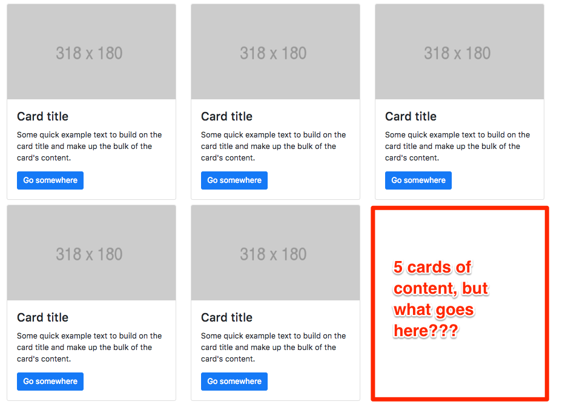

  - Explain each class and how it visually aligns content horizontally in a container.

    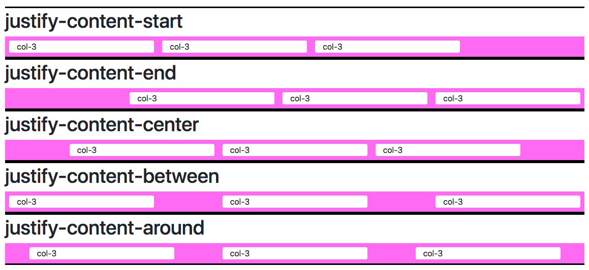

  - Using `justify-content-center` on the row class, we can center cards.

    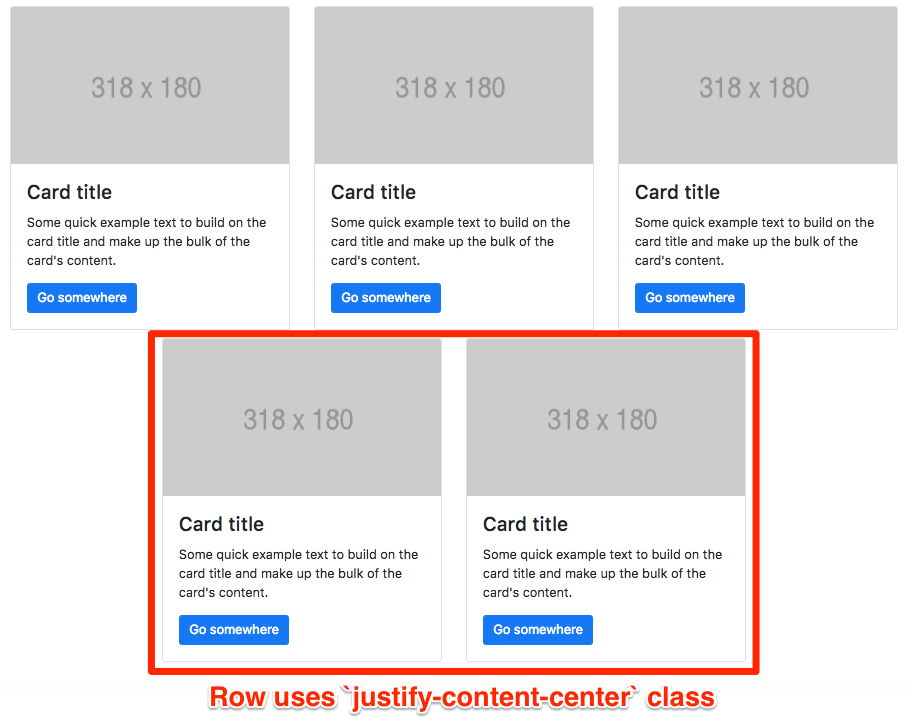

  - Bootstrap's `align-items` classes allow the all of the column containers in a row to align vertically in specified ways.

    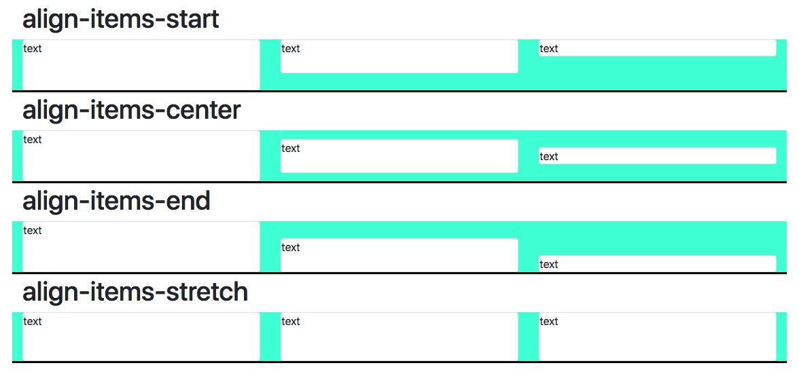

  - The `align-self` classes can be used on elements in a flex container to individually align elements vertically in a row.

    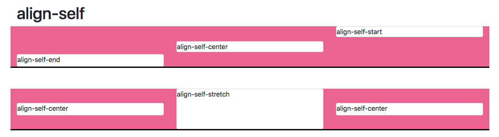

  - Bootstrap also offers a classes that aid with text alignment.

    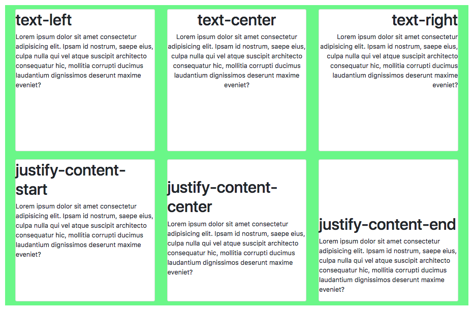

- Use slides 10-12 to show students where to place the alignment classes.

  - `justify-content` classes are usually added to the row to space horizontally.

  - `align-item` classes also are added to the `row` div to space vertically.

  - `align-self` classes are added to the `div` you want to align.

  - Text-alignment classes can be added to any div for which the the child text elements are to be aligned.

    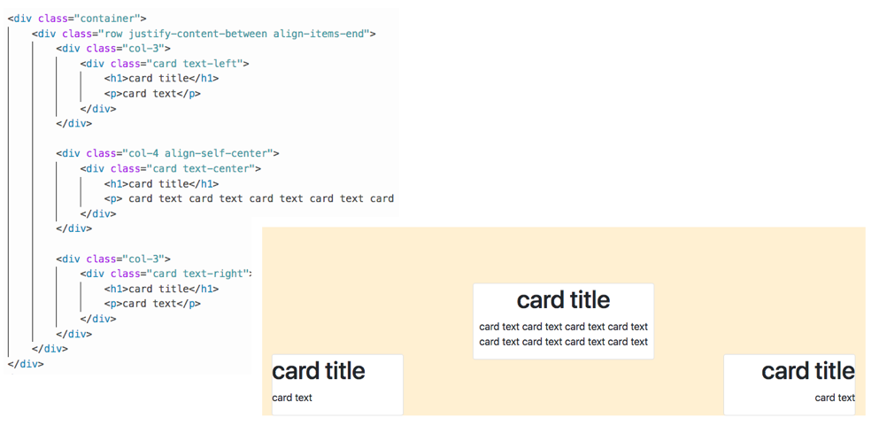

- Answer any questions before moving onto the next activity.

### 05. Students Do: Fix the Alignment (15 mins) (Critical)

- Explain to students that this activity will give them practice with using justify and align classes to alter a layout.

- In this activity, students are given an HTML and CSS documents that render three cards to a page. The goal is for students to edit the code using Bootstrap's alignment classes to replicate an image.

  - Open [03-Stu_AlignJustifyCards/alignJustify.html](Activities/03-Stu_AlignJustifyCards/Solved/alignJustify.html) in a browser to display the desired result.

  - Slack out the files in the [unsolved folder](Activities/03-Stu_AlignJustifyCards/Unsolved) as well as the instructions.

    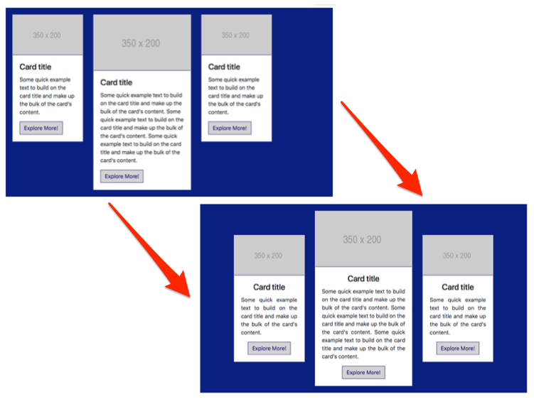

- **Files**

  - [03-Stu_AlignJustifyCards/alignJustify.html](Activities/03-Stu_AlignJustifyCards/Unsolved/alignJustify.html)

  - [03-Stu_AlignJustifyCards/style.css](Activities/03-Stu_AlignJustifyCards/Unsolved/style.css)

  - [03-Stu_AlignJustifyCards/fixAlignmentFinal.png](Activities/03-Stu_AlignJustifyCards/Unsolved/fixAlignmentFinal.png)

- **Instructions**

  - [03-Stu_AlignJustifyCards/README.md](Activities/03-Stu_AlignJustifyCards/README.md)

### 06. Instructor Do: Review Fix the Alignment (5 mins) (Critical)

- Open [03-Stu_AlignJustifyCards/alignJustify.html](Activities/03-Stu_AlignJustifyCards/Solved/alignJustify.html) in a text editor and point out the classes added in the image below.

  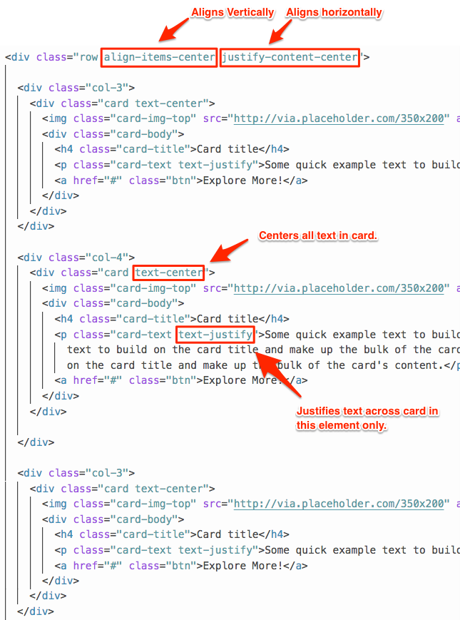

- The bonus is challenging. Open [03-Stu_AlignJustifyCards/alignJustifyBonus.html](Activities/03-Stu_AlignJustifyCards/Solved/alignJustifyBonus.html) and explain the code.

  - Inline styling is used to adjust the height of the center card.

  - The elements in the center card are wrapped in a `div`. The `d-flex` class is used to make the `card-body` class a flexbox container. Then, the `align-self-end` class is used on the new div to move it to the bottom.

    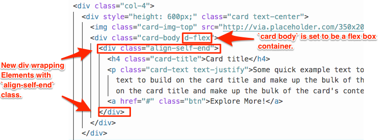

### 07. Students Do: Customize Cards (30 mins) (Critical)

- In this activity, students will continue customizing Bootstrap components. This time they will customize a set of bootstrap cards. Encourage them to use justify and align classes in their customization.

- They should create three cards:

  - One with text only (header and paragraph)

  - One with image and text.

  - One with image, text, and button.

- The cards should be styled so that on hover there is a drop shadow.

- They should create a sketch/mock-up before moving to HTML/CSS.

- They will build the HTML and CSS from scratch.

- Students should consider matching the style to today's UI challenge.

- At the end of the activity, students should create a gif of their webpage interactions and slack it out to the class with justification of their design decisions.

- There is no review activity so make sure that you and your TAs are available for hands-on support and individual questions.

- **Instructions**

  - [04-Stu-CustomCards/README.md](Activities/04-Stu-CustomCards/README.md)

### 08. Students Do. Prototyping the News (30 mins) (Critical)

- Explain to students that they will be able to use all of their Bootstrap knowledge to create a prototype of a real life webpage, The New York Times. They will practice nested grids and alignment.

- In this activity, students will create a prototype of a real website, [The New York Times](https://www.nytimes.com/). Students should create a site to match as much of the design as possible starting with the layout.

- Project the image below on the board.

- Make sure to support students as much as possible during this activity.

    

- **Files**

  - [05-Stu-NewsProtoyping/times.html](Activities/05-Stu-NewsProtoyping/Unsolved/times.html)

  - [05-Stu-NewsProtoyping/nytimes.png](Activities/05-Stu-NewsProtoyping/Unsolved/nytimes.png)

- **Instructions**

  - [05-Stu-NewsProtoyping/README.md](Activities/05-Stu-NewsProtoyping/README.md)

- At the end of this activity, slack out the solution. Encourage students who are still struggling to come to office hours for a thorough review of the solution.

### 09. BREAK (40 mins)

### 10. Students Do: Project Work - Defining the User (60 mins) (Critical)

- Students should continue to work on Project 3 individually. Explain to students that the main focus of this time should be defining the user in the "define" stage of double diamond design process.

- Students should be working on developing:

  - Proto-Personas

  - Interviews

  - User Personas

  - Empathy Maps

  - User Insights

### 11. Everyone Do: Project Critique (30 mins)

- Randomly choose students to present their user insights for critique.

### 12. Everyone Do: End Class (0 mins)

---

# LessonPlan & Slideshow Instructor Feedback

- Please click the link which best represents your overall feeling regarding today's class. It will link you to a form which allows you to submit additional (optional) feedback.

- [:heart_eyes: Great](https://www.surveygizmo.com/s3/4346059/UX-UI-Instructor-Feedback?section=17.3&lp_useful=great)

- [:grinning: Like](https://www.surveygizmo.com/s3/4346059/UX-UI-Instructor-Feedback?section=17.3&lp_useful=like)

- [:neutral_face: Neutral](https://www.surveygizmo.com/s3/4346059/UX-UI-Instructor-Feedback?section=17.3&lp_useful=neutral)

- [:confounded: Dislike](https://www.surveygizmo.com/s3/4346059/UX-UI-Instructor-Feedback?section=17.3&lp_useful=dislike)

- [:triumph: Not Great](https://www.surveygizmo.com/s3/4346059/UX-UI-Instructor-Feedback?section=17.3&lp_useful=not%great)

---

### Copyright

Trilogy Education Services © 2018. All Rights Reserved.
