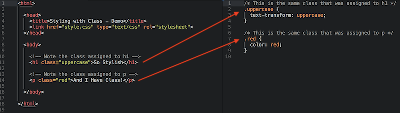
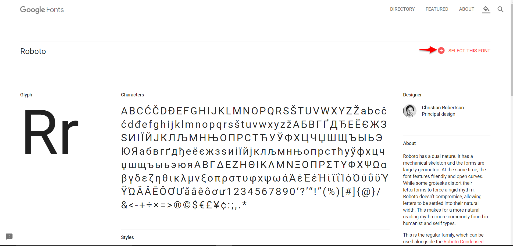
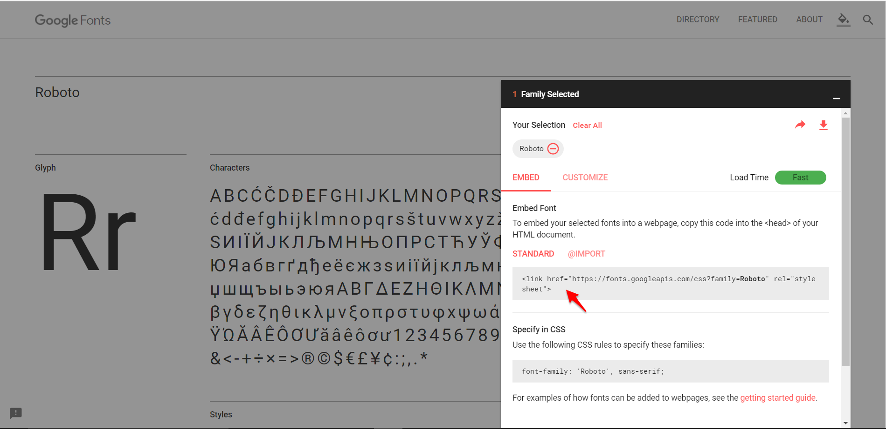

# 16.2 Lesson Plan - Advanced CSS (6:30 PM)

### Overview

Today's class will be an introduction to CSS. Students will learn how to better style webpages.

### Instructor Notes

- Use [16.2-Gitn-Pro-HTML-CSS.pptx](https://drive.google.com/open?id=1vz6ATWDzCwaW2lrN4QoFq1Mz_21qzD8b) slide show provided as an initial guide for today's class. Feel free to modify the slides slightly to fit your own style but be sure to cover the same activities.

- Keep an eye on [TimeTracker](TimeTracker.md) and the TAs in order to help keep track of time during class.

- **Note:** If groups have not yet been created for project 3, add to day 3 slides.

---

### Class Objectives

- Students will be able to implement inline CSS styles.

- Students will gain a basic understanding of common CSS properties.

- Students will be able to implement an external stylesheet.

- Students will be able to identify and implement CSS id's and classes.

- Students will be able to implement typography skills by using custom fonts.

---

### 1. Instructor Do: Welcome Class and Begin Slideshow (Slides 1-5) (5 mins)

- Open the [16.2-Gitn-Pro-HTML-CSS.pptx](https://drive.google.com/open?id=1vz6ATWDzCwaW2lrN4QoFq1Mz_21qzD8b) slide show and use it as a guide for today's class.

- Take a minute to welcome the class to day two of HTML/CSS before going through the agenda for the day.

- Open the [16.2-Gitn-Pro-HTML-CSS.pptx](https://drive.google.com/open?id=1vz6ATWDzCwaW2lrN4QoFq1Mz_21qzD8b).

- Walk through some of the tips that new programmers should take to heart when getting started with coding for the first time.

- Make sure students are aware of the resources that are available to them.

### 2. Instructor Do: HTML Round 2 (Slides 6-10) (5 mins) (Critical)

- Walk students through the HTML Round 2 slides and explain HTML syntax.

  - Be concise whenever possible. It is not necessary to explain every single item on the slides. The slides will be available to students after class. Make sure to hit the high points.

  - Review Syntax: Opening Tag --> Content --> Closing Tag.

  - Review Syntax: Attribute.

  - Review Tricky Tags (self closing).

  - Review Important and common tags.

  - There is a lot to reference so students should not attempt to memorize everything covered out of the gate.

    - Slack out this link to tag references in HTML - [w3schools: Tag reference](https://www.w3schools.com/Tags/default.asp)

### 3. Instructor Do: CSS is Neat (Slides 11-19) (5 mins) (Critical)

- Using the CSS is awesome slides as a guide, provide students with perspective on what CSS is and how it works.

- Take a moment to review what HTML and CSS stand for and how they work together to make stylish web pages.

  - HTML - Hypertext Markup Language

  - CSS - Cascading Style Sheets

- These two languages are considered to be the "primary languages of the web" as they come together to define both the content and aesthetics of a webpage. They handle everything from color and fonts to content and placement.

- HTML works like the skeleton for a web page, providing the structure and content of the page. CSS then builds upon this skeleton to provide it with a more refined appearance.

  - In other words, HTML by itself looks boring, while HTML with CSS layered onto it can look far more eye-catching and exciting.

    

- Take a moment to review CSS syntax with the class using the slide show.

  - CSS works by hooking onto selectors like element tags, classes, and identifiers. Once hooked into these elements, styles can then be applied to those selected elements using CSS rules.

  - The syntax for a CSS rule is structured as starting with a selector, the start of a declaration, the property to alter, a colon separator, the value to set the property to, a semicolon separator, and then the declaration end.

  - The image in the slides will style add a yellow background to all hyperlink elements.

  

  - *Note: The syntax for inline CSS is slightly different.*

- There are a lot of different attributes which CSS can be used to alter. Students should not attempt to memorize all of the different rules but should instead attempt to understand some of the core properties.

- Believe it or not, HTML and CSS are all that is really needed to develop a vivid/exciting website.

- There are three kinds of CSS styles that can be used in order to build styling rules into HTML.

  - Inline CSS - Generally used to apply a unique style to a single element, inline styles add the `style` attribute to the relevant element inside a HTML file.

    ```HTML
    <p style="color:red;">I'm red!</p>
    ```

  - Internal Style Sheet - Generally used when applying an unique style to a single page on a website. Internal style sheets are defined within the `<style>` element inside of the `<head>` section of an HTML page.

    ```HTML
    <head>
      ...
      <style>
        /* CSS here */
      </style>
      ...
    </head>
    ```

  - External Style Sheet - Most commonly used to change the look of an entire website by altering just one file. Each HTML page must include a reference to the external style sheet file inside of the `<link>` element within the `<head>` section. The style sheet must be saved with the `.css` extension.

    ```HTML
    <head>
      ...
      <link rel="stylesheet" href="style.css">
      ...
    </head>
    ```

- Answer whatever questions which students may have before moving onto the next topic.

### 4. Instructor Do: Inline Styles (Slides 20-22) (5 mins) (Critical)

- HTML and CSS may be considered completely separate languages but it is still possible to write CSS directly into our HTML code, using inline styles.

  - To style a single HTML element, web developers can add the style attribute directly to the opening tag using the `style` attribute.

  - After adding the `style` attribute, developers can set it equal to the CSS style desired. It is also possible to add in multiple styles so long as each CSS rule is followed by a semi-colon.

- Open up [02-Ins_InlineStyles](Activities/Solved/01-Ins_InlineStyles/inline-demo.html) within Visual Studio Code and the browser and let the class know that the elements on this page are being styled using inline CSS.

  - Point out how the header on this page is being styled using the HTML attribute `style="font-size:24px;"`. This modifies the header so that its font is smaller than usual.

    

    

  - Next point out how the paragraph element is being styled using the HTML attribute `style="color:red;"`. This modified the content so that the font is now colored red.

    

    

  - Feel free to manipulate the code and add more styles that are fun/interesting.

- Answer whatever questions the class may have before moving onto the next activity.

### 5. Students Do: Inline Styles (5 mins) (Critical)

- The class will now practice what they have learned about inline CSS styling as they modify the styling of an HTML page.

- Let students know that the `<div>` element is logically similar to `<section>`.

- **File**

  - [02-Stu_StylingInline/inline.html](Activities/Unsolved/02-Stu_StylingInline/inline.html)

- **Instructions**

  - [02-Stu_StylingInline/README.md](Activities/Unsolved/02-Stu_StylingInline/README.md)

### 6. Everyone Do: Inline Styles Review (5 mins) (Critical)

- Open up the [solved version](Activities/Solved/02-Stu_StylingInline/inline.html) of the previous activity and work through the code with the class, explaining it line-by-line and answering whatever questions the class may have.

- Make sure to review the structure of the the inline styling.

  

- Go over the bonus solution.

  - The `<div>` has a border property of 5 pixels.

  - Use this as an opportunity to quickly review the structure of lists.

  

- Show students the result in the browser before moving on.

  

### 7. Instructor Do: Style Tag (Slide 24) (5 mins) (Critical)

- Inline styles are great for small CSS changes, but they can get messy quickly.

  - For example, if a web developer wants to style every `<h1>` tag in a blog post, they would need a separate inline style for every single tag. That would take forever!

  - Thankfully, the `<style>` tag, when placed within the `<head>` section of an HTML document, gives developers a much quicker way to perform this task.

- Open up [03-Ins_StyleTag](Activities/Solved/03-Ins_StyleTag/internal-demo.html) within the browser and demo the web page before opening the file up in Visual Studio Code.

  

  - Point out how all of the styling rules have been added into the `<style>` section of the HTML file. There is no longer any need to use inline styles.

  - Also make the point that the rules posted within the `<style>` section will each and every single one of the tags that the selector points to. This means that, if a new `<p>` element were to be added to the HTML, it too would be modified by the CSS rule.

  

- Answer whatever questions students may have regarding this activity before moving onto the next one.

### 8. Students Do: Style Tag (10 mins) (Critical)

- Students will now practice what was just covered by creating a new HTML page that is styled using CSS in a `<style>` tag.

- **File**

  - [internal.html](Activities/Unsolved/04-Stu_StyleTag/internal.html)

- **Instructions:**

  - [README.md](Activities/Unsolved/04-Stu_StyleTag/README.md)

### 9. Everyone Do: Style Tag Review (5 mins) (Critical)

- Open up the [solved version](Activities/Solved/04-Stu_StyleTag/internal.html) of the previous activity.

- Explain the code line-by-line.  Alternatively, try calling on students to have them explain the code.

- Make sure to go over the new CSS properties like `text-decoration`, `width`, `text-align`, `text-transform`, and `border`.  Remind students that there are several online resources they can use to explore the options for these properties.

- Answer any questions the class may have.

  

### 10. Instructor Do: External Stylesheets (Slides 26-28) (10 mins) (Critical)

- Now that the class has worked with both inline CSS and internal stylesheets, it is time to cover the most used form of CSS in web-development: external CSS stylesheets.

  - The reason these kinds of sheets are so popular is because it keeps the CSS rules separate from the HTML files and a single stylesheet can be applied to multiple webpages.

  - The relationship between an external stylesheet and HTML files is a one-to-many relationship. Changes made to one stylesheet can affect any HTML page that references those CSS rules.

- Breakdown each section of the stylesheet link: `<link href="style.css" type="text/CSS" rel="stylesheet">`

  - The `link` attribute in this case points to a relative path, `style.css`. It is considered relative because it is referencing a location that is relative to the location of the `index.html` file.

  - If the `link` attribute was pointing to `http://www.google.com`, it would be considered an absolute path, since it includes the full url.

  - The `type` is telling the page that the file being pointed to is an external CSS file as noted by the `text/CSS` value.

  - Lastly, the `rel` attribute defines the relationship of the linked resource. In this case the relationship is that the external file is a stylesheet.

- Open [06-Ins_ExternalCSS](Activities/Solved/05-Ins_ExternalCSS/external-demo.html) within the browser and demo the webpage.

  - Then, open both files `external-demo.html` and `style.css`within Visual Studio Code to show the class how the files are linked.

### 11. Students Do: External Stylesheets (10 mins) (Critical)

- In this activity students will link an external stylesheet, `style.css`, to a HTML file, `external.html`.

- **File**

  - [index.html](Activities/Unsolved/06-Stu_ExternalCSS/index.html)

- **Instructions**

  - [06-Stu_ExternalCSS/README.md](Activities/Unsolved/06-Stu_ExternalCSS/README.md)

### 12. Everyone Do: External Stylesheets Review (5 mins) (Critical)

- Open up the [solved version](Activities/Solved/06-Stu_ExternalCSS) of the previous activity.

  - Then, open both files `external.html` and `style.css`  within Visual Studio Code. Show the class how the code in `style.css` is styling the HTML in `external.html`.

    

- Explain the code line-by-line.

  - Alternatively, try calling on students to have them explain the code.

- Answer any questions the class may have before sending them off on a break.

---

### 13. BREAK (15 mins)

---

### 14. Instructor Do: Styling With Class (Slides 30-32) (10 mins) (Critical)

- The problem with selecting elements using the tag name is that there are many times in which developers would want to style multiple elements of the same type with different rules. This is where HTML/CSS classes come into play.

  - There are two parts to this styling.

  - In your HTML file, add a `class` attribute to an HTML element and provide it with a value. Now for the CSS.

    ```HTML
    <p class="red">Lorem ipsum</p>
    ```

  - In your CSS file, select that HTML class by prepending a `.` to the beginning of the class name.

    ```CSS
    .red {
      color: red;
    }
    ```

  - In the example above, `.red` would apply `color: red;` to any element with the attribute `class="red"`.

- Classes in HTML and CSS can be used the same style to multiple elements. The `id` attribute is used to style unique elements. This will be covered in greater detail soon enough.

- Open up [08-Ins_StylingClasses](Activities/Solved/07-Ins_StylingClasses/classes-demo.html) within the browser. Then, open the HTML and CSS files in Visual Studio Code.

  - Point out the class declarations within `classes.html` as well as the selectors inside of `style.css` file.

    

  - Feel free to add a few more classes and manipulate the HTML and CSS to help students understand this process better.

- Answer whatever questions the class may have before moving onto the next activity.

### 15. Students Do: Styling With Class (10 mins) (Critical)

- Students will now take what they have learned about HTML, CSS, and classes as they create a stylized webpage.

- **Files**

  - [classes.html](Activities/Unsolved/08-Stu_StylingClasses/classes.html)

  - [style.css](Activities/Unsolved/08-Stu_StylingClasses/style.css)

- **Instructions**

  - [08-Stu_StylingClasses/README.md](Activities/Unsolved/08-Stu_StylingClasses/README.md)

### 16. Everyone Do: Styling With Class Review (5 mins) (Critical)

- Open up the [solved version](Activities/Solved/08-Stu_StylingClasses) of the previous activity.

  - Then, open both files `classes.html` and `style.css`within Visual Studio Code. Show the class how the code in `style.css` is styling the HTML in `classes.html`.

    

- Explain the code line-by-line. Answer any questions the class may have.

### 17. Instructor Do: Styling By ID (Slide 34) (5 mins) (Critical)

- Another way in which to select HTML elements for CSS styling is to use IDs instead of classes.

- IDs are the most specific form of CSS selection. In other words, whereas classes are typically used to reference a collection of elements, IDs are generally used to reference a single element.

  - While this rule is not written in stone and is not a requirement when using IDs, it is a common coding style in web development and should be used whenever possible.

- IDs are created in much the same way as classes:

  - In your HTML file, add an `id` attribute to an HTML element and provide it with a value. Now for the CSS.

    ```HTML
    <p id="red">Lorem ipsum</p>
    ```

  - In your CSS file, select that ID by prepending a `#` to the beginning of the ID.

    ```CSS
    #id {
      color: red;
    }
    ```

  - In the example above, `#red` would apply `color: red;` to the element with the attribute `id="red"`.

- Open up [10-Ins_StylingIDs](Activities/Solved/09-Ins_StylingIDs/id-demo.html) in your browser. Demo the code before opening up the HTML and CSS inside of Visual Studio Code.

  - Again, feel free to manipulate the code and add more IDs and stylings before moving on.

  - *Note: It's possible for a HTML element to have an ID and a class, but advise students it might get confusing when you're trying to target specific elements. Use with caution!*

### 18. Students Do: Styling By ID (5 mins) (Critical)

- The class will now perform much the same activity as the one done with classes, but with IDs to augment the style of the HTML this time instead.

- **Files**

  - [id.html](Activities/Unsolved/10-Stu_StylingIDs/id.html)

  - [style.css](Activities/Unsolved/10-Stu_StylingIDs/style.css)

- **Instructions**

  \-[10-Stu_StylingIDs/README.md](Activities/Unsolved/10-Stu_StylingIDs/README.md)

### 19. Everyone Do: Styling With ID Review (5 mins) (Critical)

- Open up the [solved version](Activities/Solved/10-Stu_StylingIDs) of the previous activity.

  - Then, open both files `id.html` and `style.css` within Visual Studio Code. Show the class how the code in `style.css` is styling the HTML in `id.html`.

- Call on students to explain the code to the class.

### 20. Instructor Do: Multiple Classes (5 mins) (Critical)

- Adding CSS styling based upon one class is great, but what if the developer wants to be able to quickly style some headlines red and with italics and others just red? This is where multiple selectors come into play.

  - While the application of using multiple selectors on a single element may not be obvious right off the bat, they become far more useful when it is revealed how these classes can be used to pick and choose styles for each HTML tag.

- Open up the [12-Ins_MultiSelect](Activities/Solved/11-Ins_MultiSelect/multi-demo.html) within the browser and demo the webpage before opening up the files within Visual Studio Code.

  

  - Point out how multiple classes have been used by simply adding in a space between the class values within the HTML tags.

- Answer whatever questions students may have before moving onto the next activity.

### 21. Students Do: MultiClassing (5 mins) (Critical)

- In this activity, the class will be modifying a very simple HTML page so that its elements are styled using multiple selectors.

- **Files:**

  - [multi.html](Activities/Unsolved/12-Stu_MultiClassing/multi.html)

  - [style.css](Activities/Unsolved/12-Stu_MultiClassing/style.css)

- **Instructions:**

  - [12-Stu_MultiClassing/README.md](Activities/Unsolved/12-Stu_MultiClassing/README.md)

### 22. Everyone Do: MultiClassing Review (5 mins) (Critical)

- If time permits, live code the answer example by having a student tell you what to type.

- Otherwise, open up the [solved version](Activities/Solved/12-Stu_MultiClassing/multi.html) of the previous activity, look through the code with the class, and explain it line-by-line.

  

- Create classes in `multi.html`:

  ```HTML
  <h5 class="Warrior Mage">WARRIOR MAGE</h5>

  <h5 class="Rogue Warrior">ROGUE WARRIOR</h5>

  <h5 class="Mage Rogue">MAGE ROGUE</h5>

  <h5 class="Rogue Warrior Mage">ROGUE WARRIOR MAGE</h5>
  ```

- Create the appropriate styling in `style.css`:

  ```CSS
  .Rogue{
    opacity: 0.5;
    font-style: italic;
  }

  .Warrior{
    font-size: 50px;
    font-weight: bold;
  }

  .Mage{
    color: blue;
    font-family: Cursive;
  }
  ```

### 23. Instructor Do: Web typography (Slides 36-40) (5 mins) (Critical)

- It is time once again to dive into some more specific CSS rules! This time the class will be looking into how to modify the typography of a webpage using CSS rules.

- Typography is important in design because it is a visual representation of a page's voice. As such, it is important to think carefully about the tone and look of the product or service when picking fonts.

- It is important for designers to communicate the importance of typography to developers.  They likely will not stress the importance as much as the designers should.

  - Line Length - Determines how many characters can appear on a line for optimum readability. 50 to 75 characters per line is a solid fallback usually.

    - Engage students by asking "How many pixels wide is a paragraph that has 70 characters per line?"

    - The answer varies based on font size.  A 16 pt font would have a line width of about 600 pixels.

    

  - Line Height - The distance between lines of text on a page. The golden ratio is that the line height should be 1.5 times the font size.?

  - Font Size - Determines the size of the text as written on the page. Should be at least 16px on modern pages to ensure it is easy to read.

  - There are two different kinds of typefaces that are used on webpages, display and text.

    - Display Typefaces - Entice readers, create a mood or feeling, or announce important information.

    - Text Typefaces - Are easy to read in long blocks of copy. They do not call much attention to themselves.

  - Point out the differences between Serif and Sans Serif fonts.

    - Serif typefaces include details and flourished on strokes that make up letters and symbols. Serif typefaces are among some of the oldest modern typefaces.

    - Sans serif typefaces are considered more modern, direct and precise due to their lack of detail. Character edges may be either sharp or rounded.

- Point out that good typography can make a huge difference in the aesthetic effect of a web page and answer whatever questions the class may have before moving onto the next section of today's lesson.

### 24. Instructor Do: Custom Fonts (10 mins) (Critical)

- The class has been using standard fonts in their HTML files up to this point but UI typography was covered a few weeks ago, so now this knowledge will be combined with their new coding skills and show how developers use custom fonts.

- There are many free and paid sources for custom typefaces but, for the purposes of this demonstration, the class if going to be covering [Google Fonts](https://fonts.google.com/).

  - Navigate to [Google Fonts](https://fonts.google.com/) and find a font to use.

    

  - Scroll down the page and show students how Google offers two links they will need: one for the HTML page and one for the CSS file. Copy both of these links.

    

  - Open [04-Ins-CustomFonts](Activities/Solved/13-Ins-CustomFonts/index.html) within the browser and demonstrate how the typeface remains unchanged.

  - Add the link copied from Google Fonts into `index.html` using a `<link>` element within the `<head>` section.

  - Add the Google CSS into the local `style.css` file. Apply the styling to `h1, h2, h3, h4`.

  - Refresh the page in the browser and point out the custom fonts.

    

- Remind students that they can use multiple custom fonts in much the same way as they can use multiple CSS files. However, the rule of thumb for typography is to avoid using more than 3 typefaces (1 for headers/titles, 1 for body copy, 1 for special occasions/quotes).  This, of course, comes with a performance drawback for every file they start adding.

### 25. Students Do: Custom Fonts and Typography (Slides 24-25) (10 mins) (Critical)

- In this activity, students will be applying their knowledge of typography to the portfolio pages they began work on earlier.

- **Resources:**

  - [index.html](Activities/Unsolved/14-Stu_CustomTypography/index.html)

  - [style.css](Activities/Unsolved/14-Stu_CustomTypography/style.css)

- **Instructions:**

  - [14-Stu_CustomTypography/README.md](Activities/Unsolved/14-Stu_CustomTypography/README.md)

### 26. Instructor Do: Custom Fonts and Typography Review (5 mins) (Critical)

- Open up the [solved version](Activities/Solved/14-Stu_CustomTypography/index.html) of the previous activity and walk through the code line-by-line with the class, answering whatever questions students may have.

### 27. Instructor Do: Recap (Slide 42) (5 mins) (Critical)

- Whew, that was a lot!

- Congratulate the class on making it through today. This has likely been a tough day for the class.

- Remind them to take a deep breath and count to five. Coding is hard, but assure them they will get it with practice, practice, practice.

  - Encourage students to review and retry today's activities.

- Ask if there are any questions or topics that need clarification before dismissing the class.

### 28. Everyone Do: End Class (0 mins)

---

### LessonPlan & Slideshow Instructor Feedback

- Please click the link which best represents your overall feeling regarding today's class. It will link you to a form which allows you to submit additional (optional) feedback.

- [:heart_eyes: Great](https://www.surveygizmo.com/s3/4346059/UX-UI-Instructor-Feedback?section=16.2&lp_useful=great)

- [:grinning: Like](https://www.surveygizmo.com/s3/4346059/UX-UI-Instructor-Feedback?section=16.2&lp_useful=like)

- [:neutral_face: Neutral](https://www.surveygizmo.com/s3/4346059/UX-UI-Instructor-Feedback?section=16.2&lp_useful=neutral)

- [:confounded: Dislike](https://www.surveygizmo.com/s3/4346059/UX-UI-Instructor-Feedback?section=16.2&lp_useful=dislike)

- [:triumph: Not Great](https://www.surveygizmo.com/s3/4346059/UX-UI-Instructor-Feedback?section=16.2&lp_useful=not%great)

---

### Copyright

Trilogy Education Services © 2018. All Rights Reserved.
